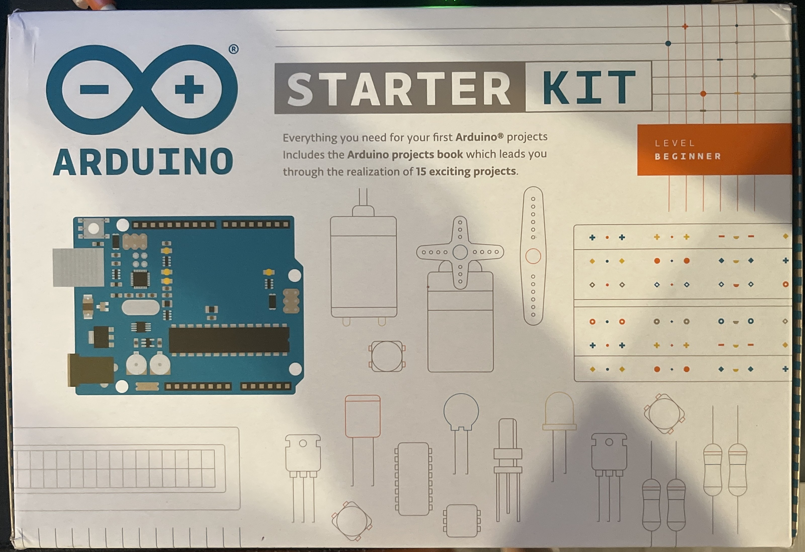

# HW 0: Introduction and Setup

Hello there, come with me as I set up my Arduino Uno for the first time.

## Unboxing

The Arduino kit come inside this box and inside there's an assorment of components.

Some of these things include the Arduino Uno, a breadboard, wires, motors, resistors etc.

## Setting Up the Hardware

The chapter first starts off by explaining the different parts that come in the kit.
Along with an explanation of the Arduino board.
Then it has you assemble the Arduino and breadboard onto a stand.

## Setting Up the Software

Once I had that all set up it was time to install the IDE.
After downloading the IDE it asked you to connect the board to your computer. 
Shown in the image above there's a green light that represents that the Arduino is on.
Once the computer is able to talk to the board it's time to upload code. 

## Code: Blink

The book first asks you to choose the serial port.
Mine only had one and it popped up right away so I had no problems with that.
But if it didn't I would have to try all of them until it worked.
It then asked you to open up the Blink Sketch and upload it to your Arduino.
The Blink Sketch is a program that repetitevly turns the LED on the Arduino on and off. 

Though before I uploaded the sketch the Arduino was already blinking.
According to the book sometimes a brand new Arduino is already programmed with that sketch.
So, in order to see if it is working they recomend to lower the delay time. 
In the video below you are able to see that it first blinks slowly, then in the second half it blinks faster.

That's because in the first half of the video the delay is 1000 ms while in the second half it's 100 ms.

## Summary

Overall, in this chapter I learned how to set up my Arduino for future projects. Along with terminology of the other parts I'd be using in the future.
