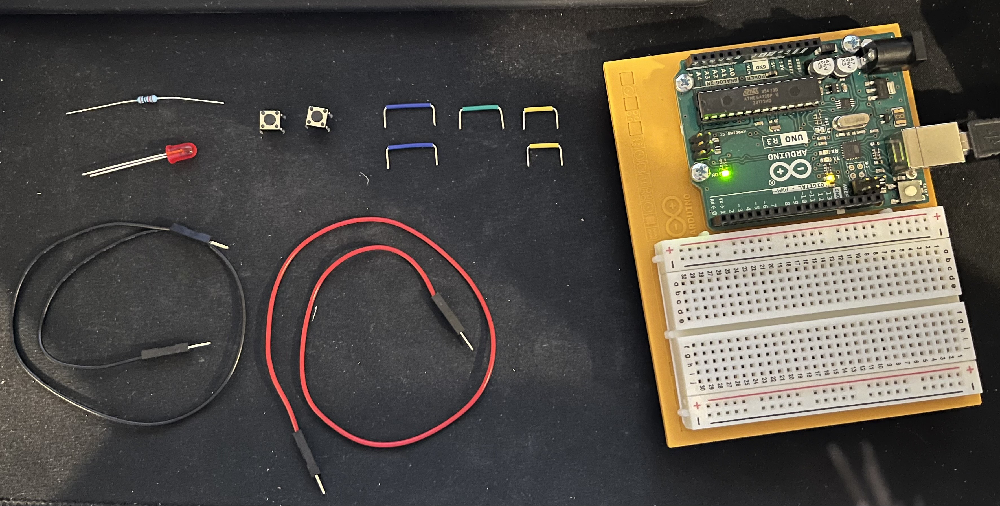

# HW 1: Get to Know Your Tools
Hello there, come with me as I make an interactive circuit that turns an LED on when a button is clicked.

## Materials

The materials needed for this project were the Arduino Uno, breadboard, 220 ohm resistor, jumper wires, buttons, and a LED.

## Creating the Circuit

Before building your circuit make sure any battery or USB is disconnected.

Step 1: Connect the red wire to the 5V pin on the Arduino and put the other end in one of the positive long bus lines in your breadboard. 

We're going to use the red wire for power.

Step 2: Place your switch across the center of the board. The legs should point away from the center.

Step 3: Place a 220 ohm resistor to connect power to the positive long bus line to one side of the switch.

Step 4: Add an LED below the left side of the switch with the anode (long leg) facing the top of the board and the cathode (short leg) facing the bottom. 

Step 5: Place a jumper wire from the bottom left of the switch to the anode.

Step 6: Connect the black wire to the ground pin on the Arduino and put the other end in the pin next to the red wire making sure it's in the negative long bus line in your breadboard. 

We're going to use the black wire for ground.

## Setting Up the Software

Once I had that all set up it was time to install the IDE.
After downloading the IDE it asked you to connect the board to your computer. 
Shown in the image above there's a green light that represents that the Arduino is on.
Once the computer is able to talk to the board it's time to upload code. 

## Code: Blink

The book first asks you to choose the serial port.
Mine only had one and it popped up right away so I had no problems with that.
But if it didn't I would have to try all of them until it worked.
It then asked you to open up the Blink Sketch and upload it to your Arduino.
The Blink Sketch is a program that repetitively turns the LED on the Arduino on and off. 

Though before I uploaded the sketch the Arduino was already blinking.
According to the book, sometimes a brand new Arduino is already programmed with that sketch.
So, in order to see if it is working they recommend lowering the delay time. 
In the video below you are able to see that it first blinks slowly, then in the second half it blinks faster.

That's because in the first half of the video the delay is 1000 ms while in the second half it's 100 ms.

## Summary

Overall, in this chapter I learned how to set up my Arduino for future projects. Along with terminology of the other parts I'd be using in the future.

