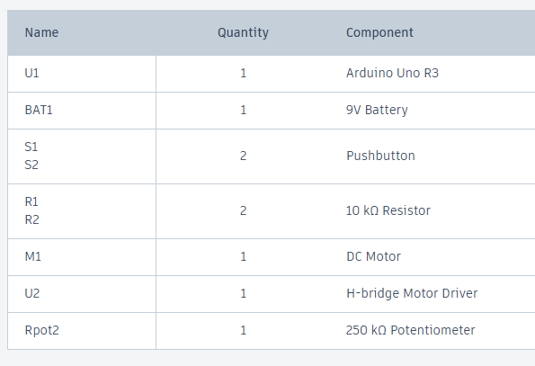

# HW 10: Zoetrope
Hello there, come with me as I make a Zoetrope.

## Materials

The materials needed for this project were the Arduino Uno, breadboard, 9V battery, a battery snap, DC motor, a potentiometer, 2 10 Kohm resistors, a H bridge, 2 buttons, and jumper wires.

If you want to create it in TinkerCad the materials are listed below.

## Creating the Circuit

Before building the circuit, I had to make sure any battery or USB was disconnected.

Step 1: I connected power and ground to the breadboard from the 5V and GND pin.

Step 2: I added two buttons to the breadboard and connected one leg to power and one leg to ground through a 10 Kohm resistor.
I also attached one leg to digital pins 4 and 5.

Step 3: I then connected a potentiometer to the breadboard. 
I wired one side to ground and the other to power. 
Then the center pin got attached to analog pin 0.

Step 4: I placed the H bridge in the center of the breadboard.
This is how I connected the H bridge using jumper wires.
H bridge pin 1 to digital pin 9.
H bridge pin 2 to digital pin 3.
H bridge pin 4 to ground.
H bridge pin 5 to ground.
H bridge pin 7 to digital pin 2.
H bridge pin 16 to power on the left side of the breadboard.

Step 5: I connected the motor's red wire to H bridge pin 6 and the black wire to H bridge pin 3.

Step 6: I connected the battery to power and ground on the right side of the breadboard. 
I then took a jumper wire and connected the left ground to the right ground.
I also took a jumper wire and connected the right power to H bridge pin 8.

Step 7: I uploaded the code provided for this exercise to the Arduino.

Now I have completed the Zoetrope.
As you can see the motor spins when I turn the potentiometer and it changes directions depending on which button I press.

The video below demonstrates this.

Below is also a schematic view of the project as well.

## Summary

Overall, in this chapter I learned how to make a Zoetrope that spins in a certain direction when a potentiometer is turned and a button is pressed.

