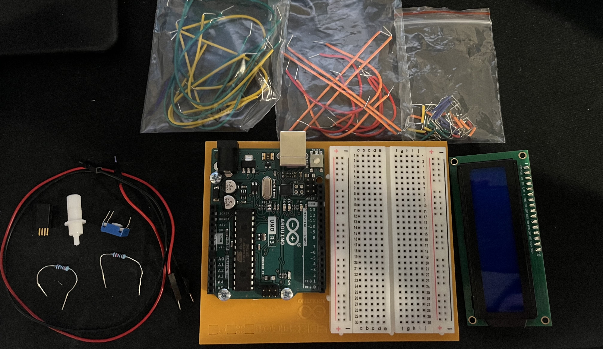
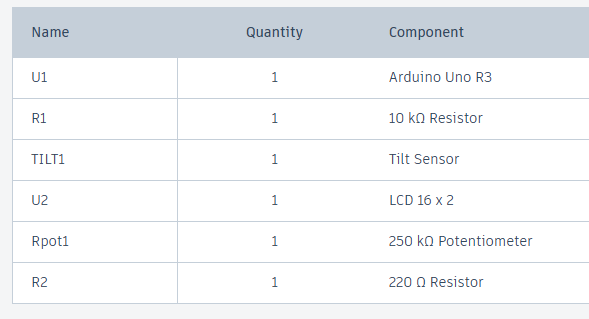
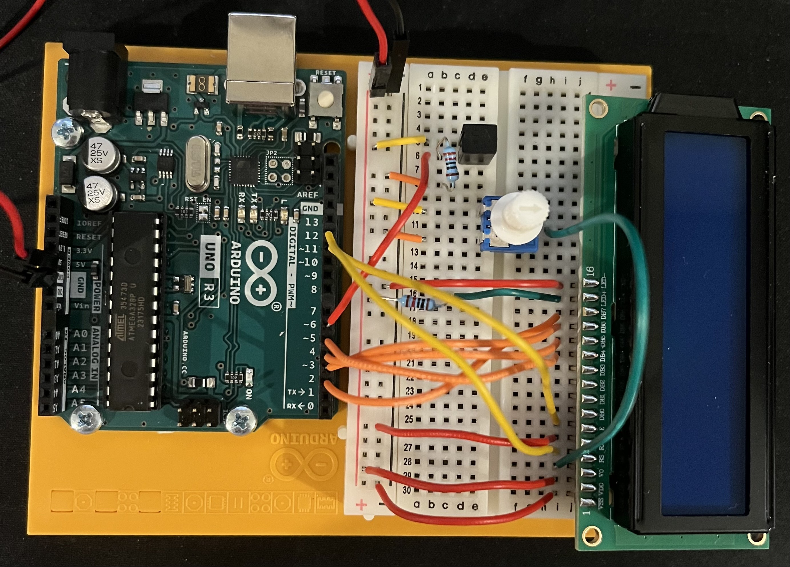
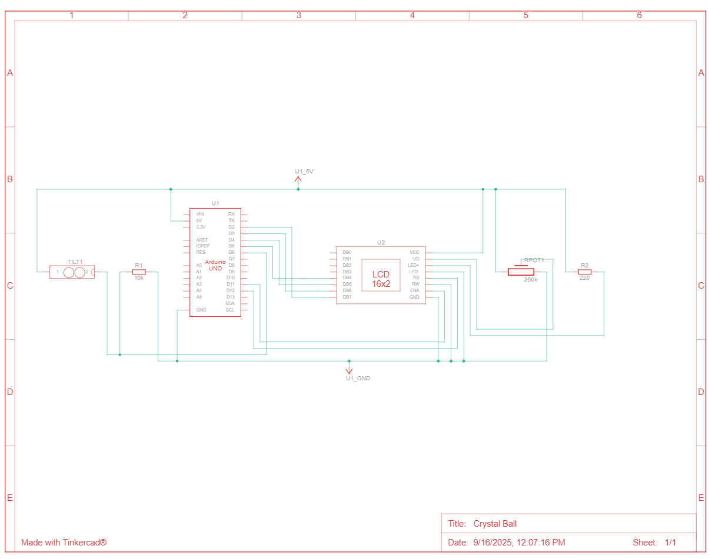

# HW 11: Crystal Ball
Hello there, come with me as I make a Crystal Ball.

## Materials

The materials needed for this project were the Arduino Uno, breadboard, 1 220 ohm resistor, 1 10 Kohm resistor, a potentiometer, a tilt switch, a LCD screen, and jumper wires.

If you want to create it in TinkerCad the materials are listed below.

## Creating the Circuit

Before building the circuit, I had to make sure any battery or USB was disconnected.

Step 1: I connected power and ground to the breadboard from the 5V and GND pin.

Step 2: I connected the tilt switch to the breadboard and connected one leg to power.
The other leg connected to ground through a 10 Kohm resistor and to digital pin 6.

Step 3: I attached the LCD to the breadboard and connected the following pins.
LCD- to ground.
LCD+ to power through a 220 ohm resistor.
R/W to ground.
VDD to power.
VSS to ground.

Step 4: Now I connected pins to digital pins. 
DB7 to digital pin 2.
DB6 to digital pin 3.
DB5 to digital pin 4.
DB4 to digital pin 5.

Step 5: I connected more pins.
RS to digital pin 12.
E to digital pin 11

Step 6: I then attached the potentiometer to the breadboard.
I connected one leg to power and the other to ground.
Then I connected the center leg to V0 on the LCD.

Step 7: I uploaded the code provided for this exercise to the Arduino.

Now I have completed the Crystal Ball.
As you can see the screen changes phrases when the tilt sensor detects a certain angle.

The video below demonstrates this.

Below is also a schematic view of the project as well.

## Summary

Overall, in this chapter I learned how to make a Crystal Ball that changes phrases based on the angle the tilt switch is at.
