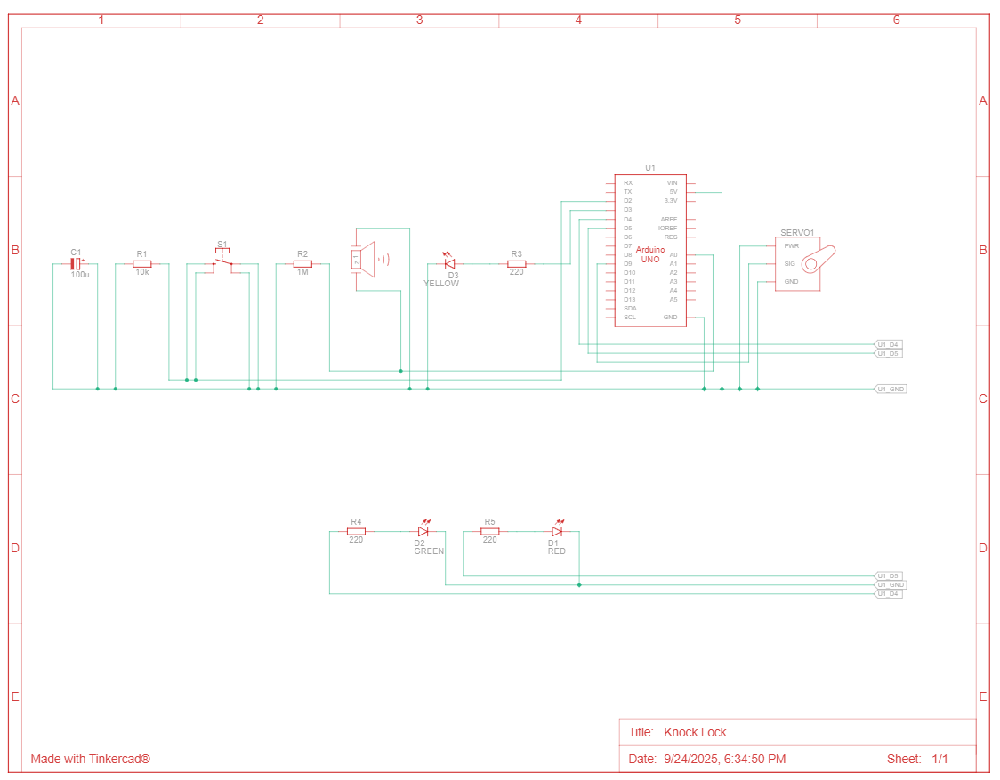

# HW 12: Knock Lock
Hello there, come with me as I make a Knock Lock.

## Materials

The materials needed for this project were the Arduino Uno, breadboard, 3 220 ohm resistor, 1 10 Kohm resistor, 1 Mohm resistor, a piezo, a servo motor, a button, a red LED, a green LED, a yellow LED, a capacitor, 3 male headers, and jumper wires.

If you want to create it in TinkerCad the materials are listed below.

## Creating the Circuit

Before building the circuit, I had to make sure any battery or USB was disconnected.

Step 1: I connected power and ground to the breadboard from the 5V and GND pin.

Step 2: I first connected power and ground to the other side of the breadboard.
I then took a button and placed it in the middle of the breadboard.
One leg went to power, one went to digital pin 2, and another went to ground through a 10 Kohm resistor.

Step 3: I connected the piezo to the breadboard.
I attached one leg to pin A0 and to ground through a 1 Mohm resistor.
The other leg was attached to power.
The piezo that comes in the box isn't polarized so it doesn't matter what leg is connected to what.

Step 4: I connected the LED to the breadboard.
I connected the cathode to ground and placed a 220 ohm resistor in series with the anode.
Through their respected resistors I conneted the LEDs to digital pin.
Yellow went to 3, green went to 4, and red went to 5.

Step 5: I took the male headers and inserted them into the female socket on the servo motor.
I connected the red wire to power, the black to ground, and white to digital pin 9.
I also took a capacitor and put it across power and ground to smooth out any irregularities in voltage.

Step 6: I uploaded the code provided for this exercise to the Arduino.
The code checks if the servo motor is in a locked state and then checks for a certain number of knocks that then unlock the servo and changes the LEDs. 
It also checks if a knock is valid or not, if it is the yellow LED is set to LOW.

Now I have completed the Knock Lock.
As you can see the LEDs change color and the servo rotates when I tap on the piezo a certain way.

The video below demonstrates this.

Below is also a schematic view of the project as well.

## Summary

Overall, in this chapter I learned how to make a Knock Lock that changes the color of LEDs and servo rotation based on vibrations that the piezo recieves.
