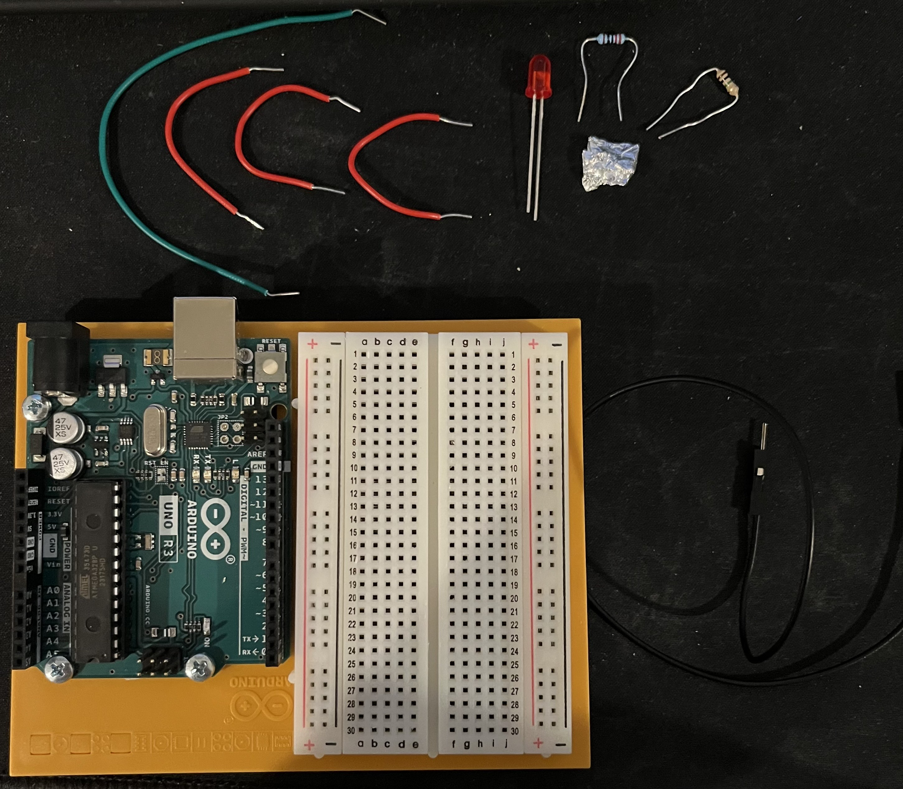
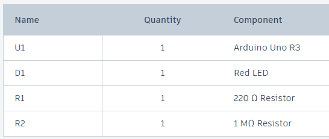
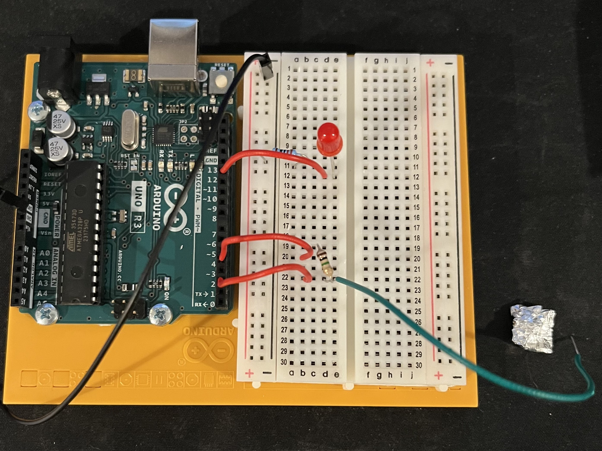
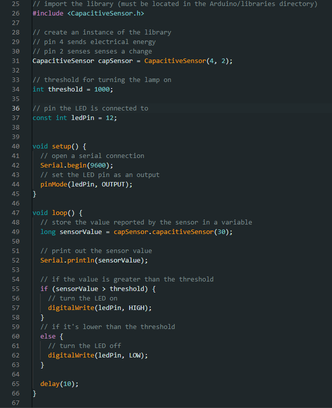
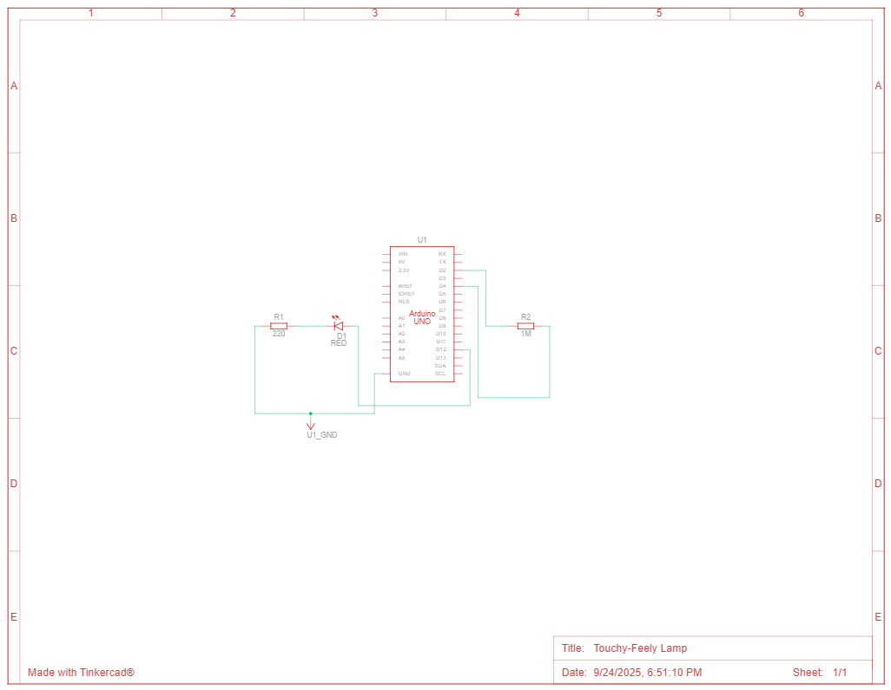

# HW 13: Touchy-Feely Lamp
Hello there, come with me as I make a Touchy-Feely Lamp.

## Materials

The materials needed for this project were the Arduino Uno, breadboard, 1 220 ohm resistor, 1 1 Mohm resistor, 1 red LED, 1 piece of metal foil, and jumper wires.

If you want to create it in TinkerCad the materials are listed below.

## Creating the Circuit

Before building the circuit, I had to make sure any battery or USB was disconnected.

Step 1: I connected ground to the breadboard from GND pin.

Step 2: I connected the LED to the breadboard.
The anode went to digital pin 12 and the cathode went to ground through a 220 ohm resistor.

Step 3: I connected digital pins 2 and 4 to a 1 Mohm resistor.
I then took another wire and connected the leg that went to digital pin 2 to a piece of metal foil.
I used Reynolds Wrap Non-Stick Aluminum Foil. 

Step 4: I uploaded the code provided for this exercise to the Arduino.
The code checks if the wire is touching the metal foil and if it is, it turns on the LED.

Now I have completed the Touchy-Feely Lamp.
As you can see the LED turns on when the wire is connected to metal.

The video below demonstrates this.

Below is also a schematic view of the project as well.

## Summary

Overall, in this chapter I learned how to make a Touchy-Feely Lamp that activates an LED when a wire is touching metal foil.
It also makes your finger feel weird if your holding the metal foil while it's on. 
