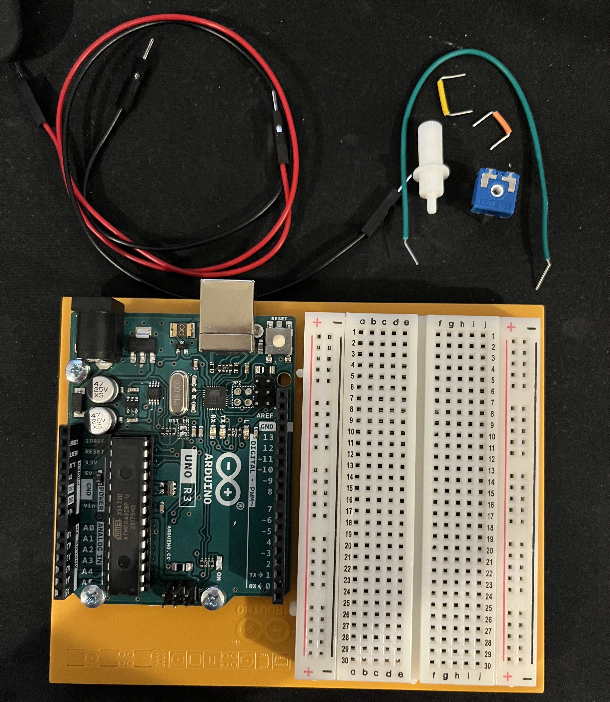
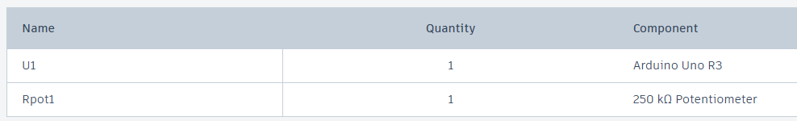
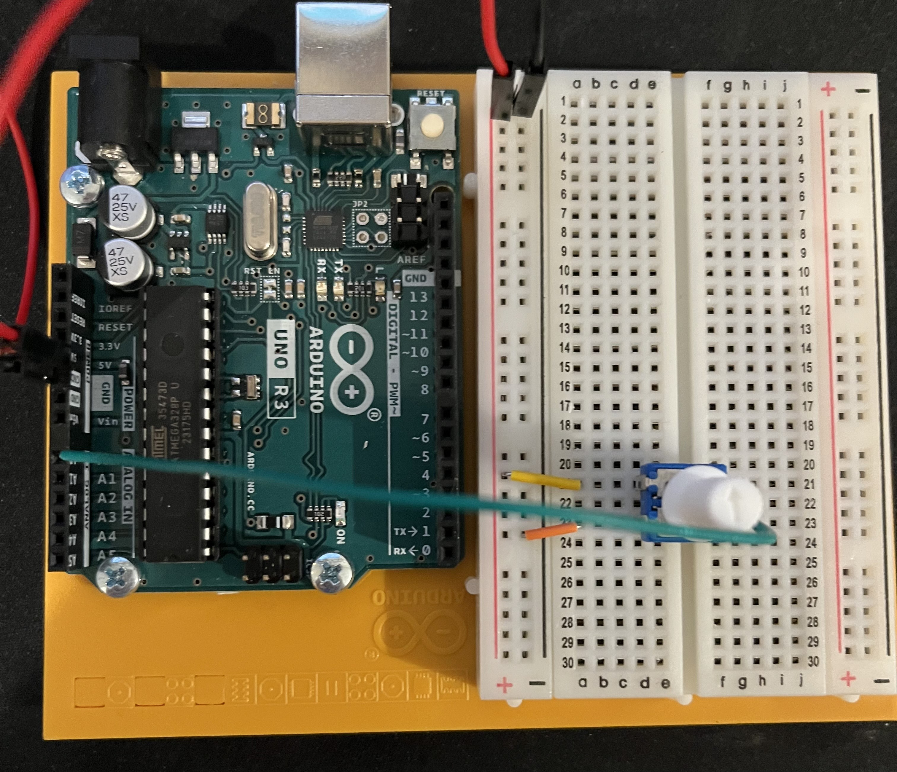
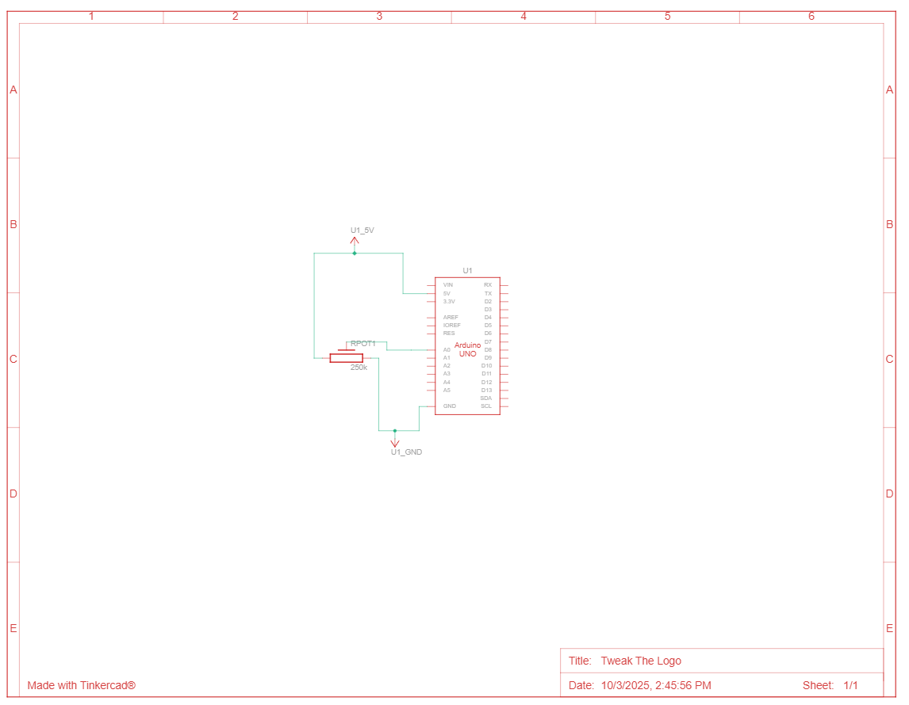

# HW 14: Tweak the Logo
Hello there, come with me as I make Tweak the Logo.

## Materials

The materials needed for this project were the Arduino Uno, breadboard, a potentiometer, and jumper wires.

If you want to create it in TinkerCad the materials are listed below.

## Creating the Circuit

Before building the circuit, I had to make sure any battery or USB was disconnected.

Step 1: I connected power and ground to the breadboard from 5V and GND pin.

Step 2: I connected the potentiometer to the breadboard.
I attached the left leg to power, the middle to pin A0, and the right to ground.

Step 4: I uploaded the code provided for this exercise to the Arduino.
The code sends the potentiometer value to the programming environment called Processing.
Which I had to download before hand. 
In the processing script it grabs an image off online and then loads it into a window. 
It also takes the information sent from the arduino and changes the color of the background.
During this step I had a problem with the code provided in the book.
The url they gave for the image didn't exist so I had to find a new image.
I also then made the window a bit bigger than the image so you can see the background changing color.
I debugged this by going to the Arduino forums to see if other people had the same issue. 

Now I have completed Tweak the Logo.
As you can see the background changes color based on the potentiometer value.

The video below demonstrates this.

Below is also a schematic view of the project as well.

## Summary

Overall, in this chapter I learned how to Tweak the Logo by taking values from the Arduino and sending it to Processing.
These values were used to change the hue of the background.
