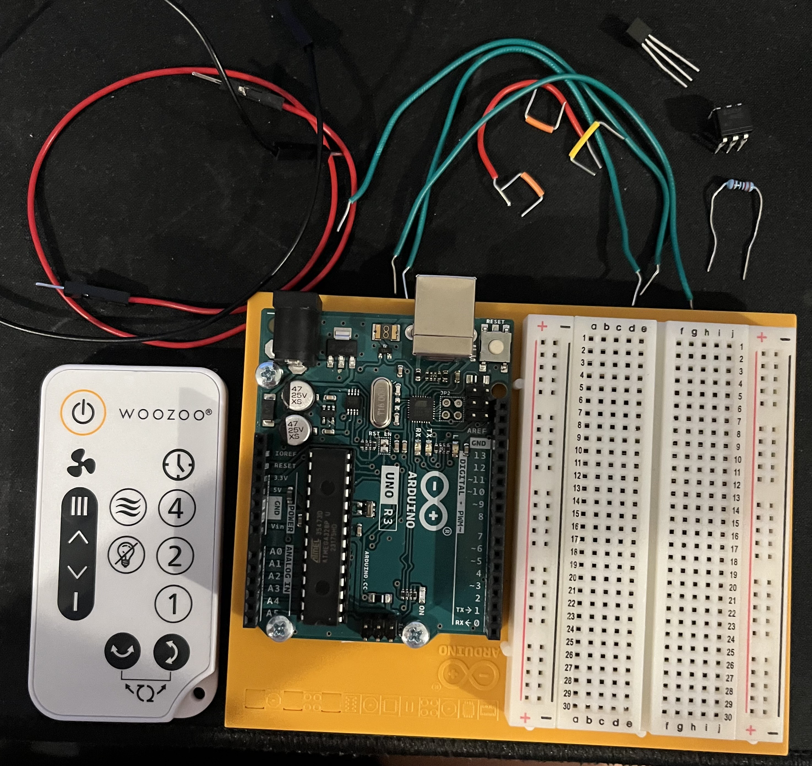
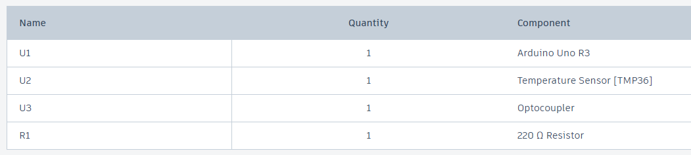
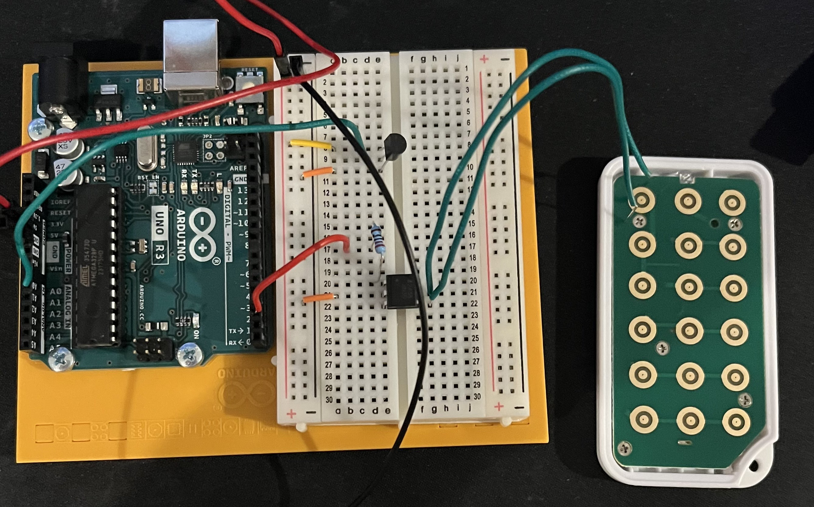
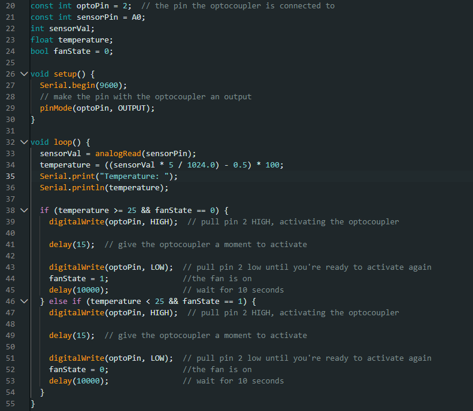
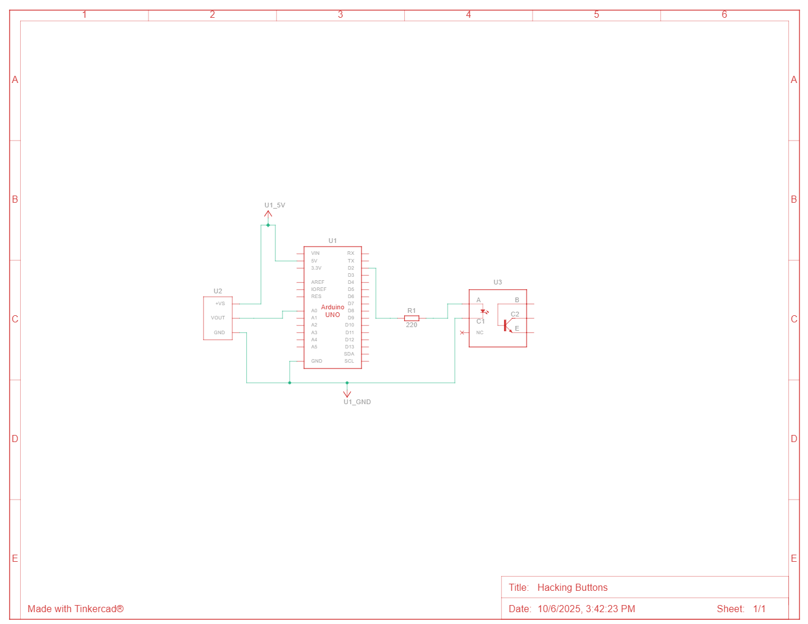

# HW 15: Hacking Buttons
Hello there, come with me as I make Hacking Buttons.

## Materials

The materials needed for this project were the Arduino Uno, breadboard, a temperature sensor, a 220 ohm resistor, an optocoupler, a remote controlled fan, and jumper wires.

If you want to create it in TinkerCad the materials are listed below.

## Creating the Circuit

Before building the circuit, I had to make sure any battery or USB was disconnected.

Step 1: I connected power and ground to the breadboard from 5V and GND pin.

Step 2: I connected the temperature sensor to the breadboard. The left pin went to power, the middle went to pin A0, and the right went to ground.

Step 3: Then I connected the optocoupler. There is a dot indicating which pin is the first one. The first pin which is the top left goes to ground through a 220 ohm resistor. The middle left pin went to gound. While the middle and bottom right pins go to the device. Specifically, the middle right one would go the grounded side of the fork while the bottom right goes to the other side. 

Step 4: I uploaded the code provided for this exercise to the Arduino.
The code gets the temperature from the sensor and then checks if the fan is on or off and if the temperature is within a certain range. If it is, it then turns the fan on or off depending on the previous state. 

Now I have completed Hacking Buttons.
As you can see the fan turns on and off when the it reaches a certain temperature.

The video below demonstrates this.

Below is also a schematic view of the project as well.

## Summary

Overall, in this chapter I learned how to hack buttons by taking a remote and wiring up it up to the Arduino which causes the fan to turn on and off at a certain temperature.
