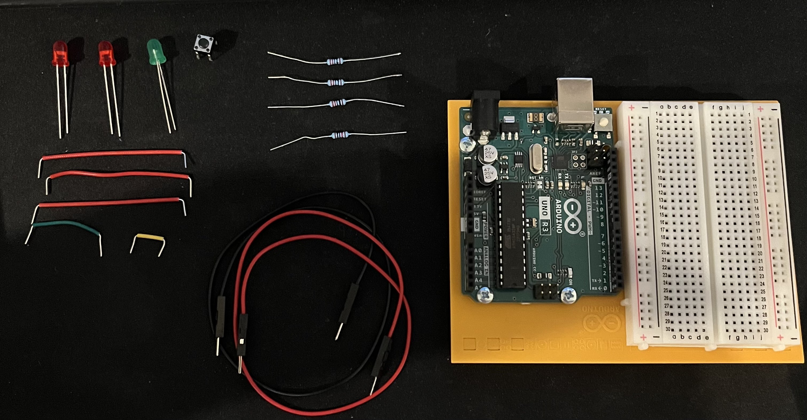
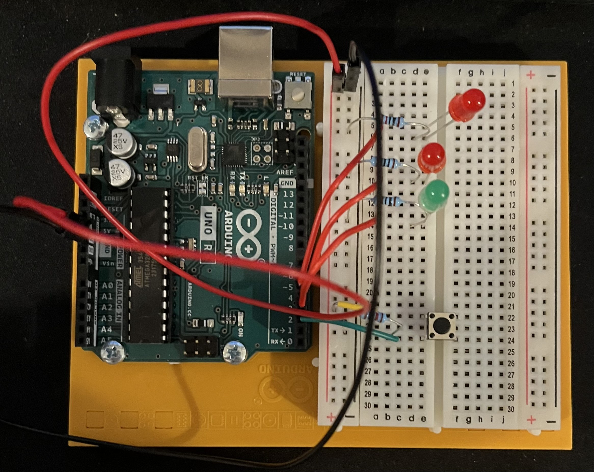
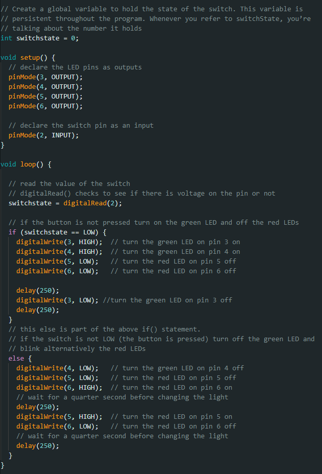
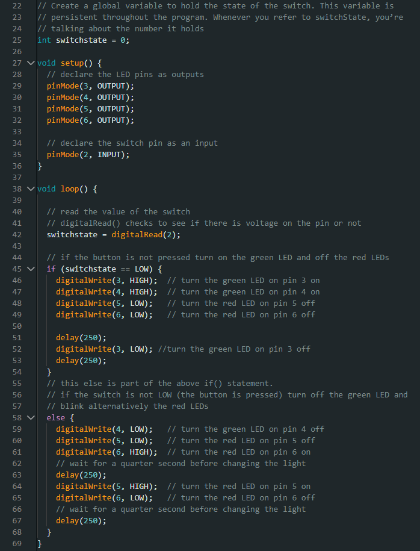

# HW 2: Spaceship Interface
Hello there, come with me as I make a Spaceship Interface.

## Materials

The materials needed for this project were the Arduino Uno, breadboard, 3 220 ohm resistor, 1 10 Kohm resistor, jumper wires, 1 button, 2 red LEDs, and 1 green LED.

## Creating the Circuit

Before building the circuit I had to make sure any battery or USB was disconnected.

Step 1: I connected the three LEDs using a jumper wire and connected it from the anode to pins 3, 4, and 5.

3 is green, 4 and 5 are red.

Then attach the 220 ohm resistor to the ground and the cathode of the LED.

Step 2: I placed the button into the bread board with the legs facing away from the center.
Then I attached one side to power using a jumper cable and the other side to a 10 Kohm resistor and jumper cable that leads into pin 2.

Step 3: I connected power and ground to the bread board from the 5V and GND pin.

Step 4: I uploaded the code provided for this exercise to the Arduino.

Now I have a completed Spaceship Interface. 
If I hit the button the green light will turn off and the red lights will blink in an alternative pattern.

The video below demonstrates this.

## Spaceship Interface Challenge

The challenge was to add a green LED that blinks whenever the button is not pressed.

In order to make this work, I had to add another LED and change the code a little bit.
For the code I just had to change the number that represented which pin it was in. I also had to add in code that caused the 2nd green LED to blink.
I did this by changing the value of the 2nd LED and switching it once a certain amount of time has passed.

The video below demonstrates this.

## Summary

Overall, in this chapter I learned how to make a Spaceship Interface that involves changing the values of LEDs when a button is pressed.
I also decided to put the resistors into small bags and label the bags so it's not a struggle in future exercises to figure out which one is which. 
