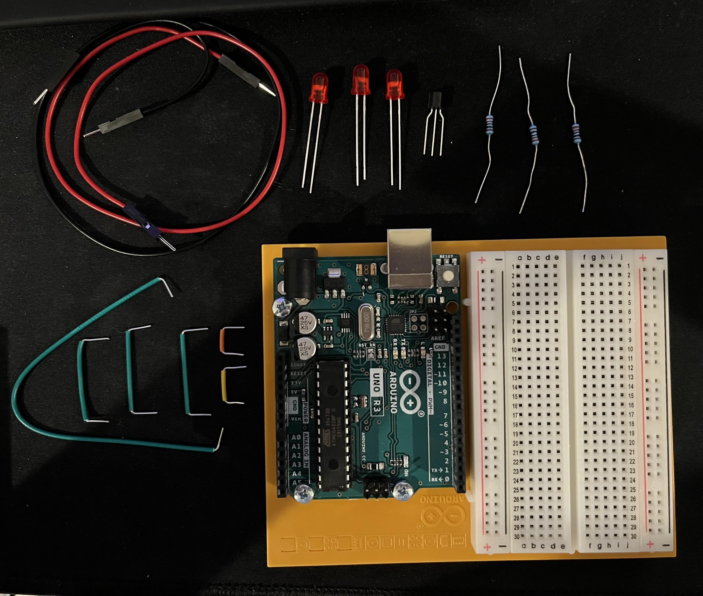
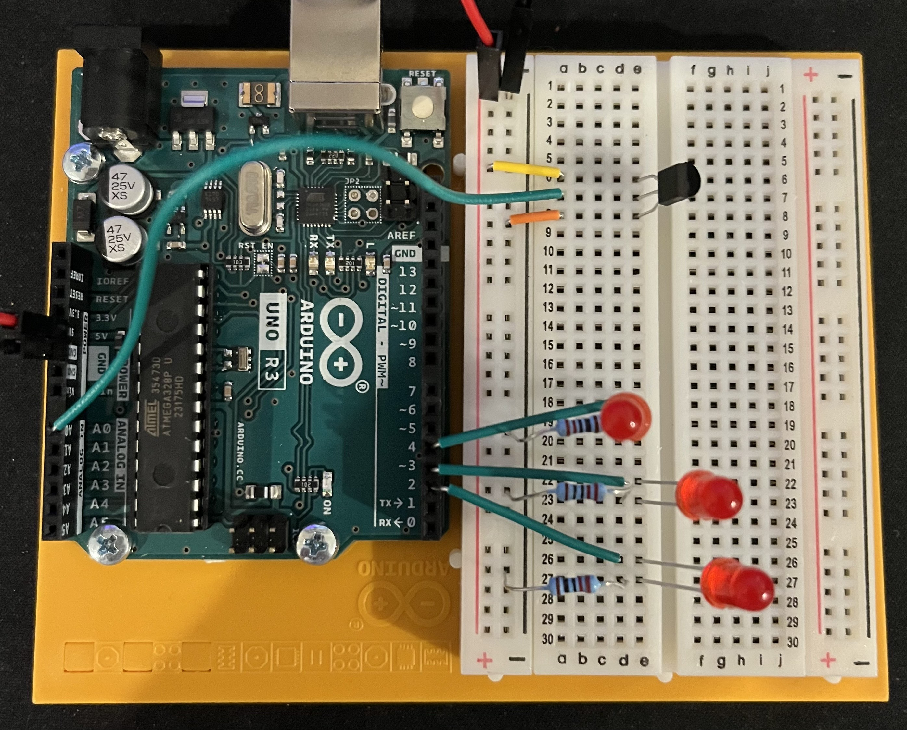
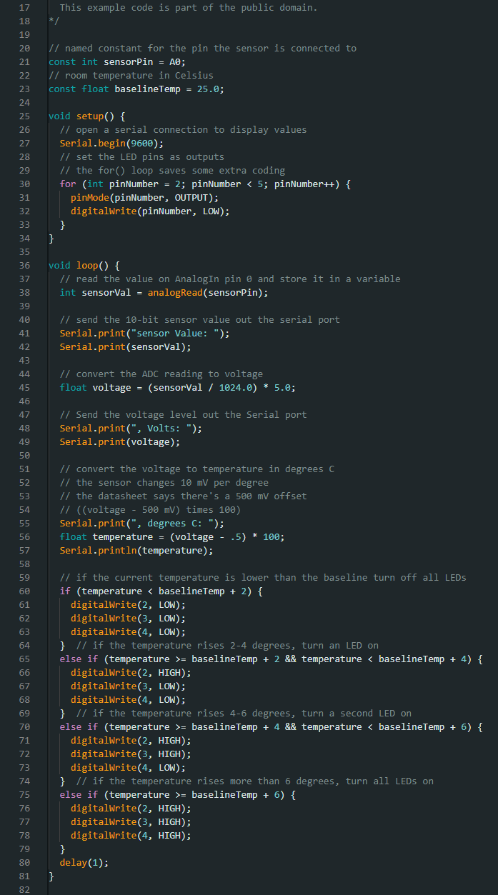

# HW 3: LoveOMeter
Hello there, come with me as I make a LoveOMeter.

## Materials

The materials needed for this project were the Arduino Uno, breadboard, 3 220 ohm resistor, 1 temperature sensor, jumper wires, and 3 red LEDs

Make sure not to mix up the temperature sensor and capacitors. In the box there's only 1 temperature sensor and it might say TMP on it.

## Creating the Circuit

Before building the circuit I had to make sure any battery or USB was disconnected.

Step 1: I connected power and ground to the breadboard from the 5V and GND pin.

Step 2: I connected the three LEDs using a jumper wire and connected it from the anode to pins 2, 3, and 4.

I then attach the 220 ohm resistor from the ground to the cathode of the LED.

Step 3: I placed the temperature sensor into the breadboard with the flat side facing the Arduino.
Then I attached jumper wires connecting the top to power, the middle to pin A0, and the bottom to ground.

Step 4: I uploaded the code provided for this exercise to the Arduino.

Though in order to get it working I did have to change the baseline temperature to 25 C instead of 20 C.
This is because the room I was in was a bit warmer.

Now I have a completed LoveOMeter. 
If I touch the temperature sensor the LEDs will start to light up one at a time.
Then once I remove heat the LEDs will start to turn off.

The video below demonstrates this.

## Summary

Overall, in this chapter I learned how to make a LoveOMeter that involves changing the values of LEDs when a certain temperature is read by the temperature sensor.
I also learned about the serial monitor in the Arduino IDE. 
In this exercise it was able to tell me what the temperature sensor was reading which is how I figured out the baseline.

