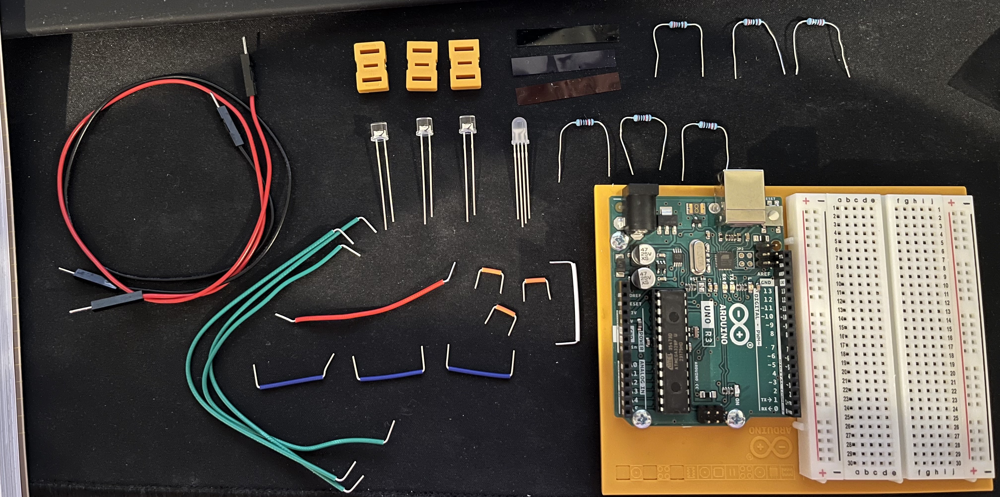
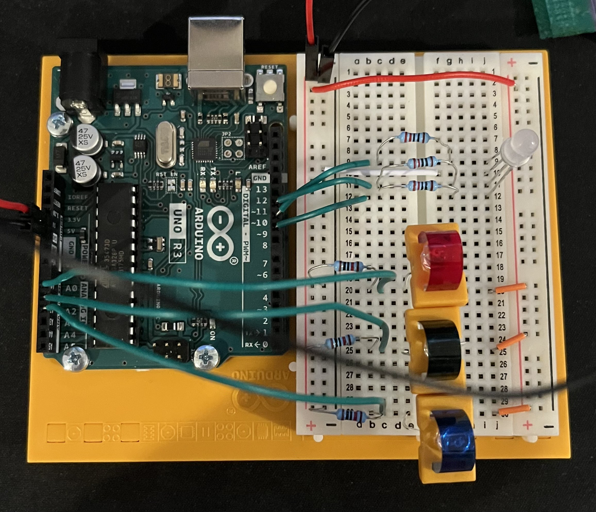

# HW 4: Color Mixing Lamp
Hello there, come with me as I make a Color Mixing Lamp.

## Materials

The materials needed for this project were the Arduino Uno, breadboard, 3 220 ohm resistors, 3 10 Kohm resistors, 3 phototransistors, 1 LED with 4 legs, and 3 colored gels.

There should be 1 red, 1 green, and 1 blue colored gel.

## Creating the Circuit

Before building the circuit I had to make sure any battery or USB was disconnected.

Step 1: I connected power and ground to the breadboard from the 5V and GND pin.

Step 2: I connected the phototransistors by putting the anode on the right side and the cathode on the left side of the breadboard.
Then I took power from the right side and connected it to the anode.
Afterwards I took jumper wires and connected it from the cathode to analog pins 0, 1, and 2.
Finally, I added a 10 Kohm resistor before the jumper cable connecting it with the ground on the left side of the breadboard

Step 3: I removed the phototransistors and put them through the middle of the orange plastic piece.
These plastic pieces held in place the colored gels.
The red colored gel was assigned to the phototransistor that was connected to A0.
The green colored gel was assigned to the one connected to A1.
While the blue colored gel was assigned to the one connecting to A2.
While doing this process I did have to move around the jumper wires, resistors, and phototransistors so the orange pieces weren't hitting each other.
A problem I had was if the orange pieces even slightly moved the colored gels would pop right out.
I fixed this by putting more space in between the transistors and spreading the wires far apart so the orange piece didn't slide down.

Step 4: After the colored gels stopped popping out it was time to connect the LED. 
The way I placed it in the breadboard was red, cathode, blue, and then green. 
This was going from top to bottom, I also stuck it on the right side of the breadboard.
Then I took a jumper wire and attached the cathode to ground. 
I then took a 220 ohm resistor for each anode and connected them to the other side of the breadboard.
Then using a jumper wire I connected the other end of the resistor to pins 11, 10, and 9.
11 was blue, 10 was red, and 9 was green.
I also had to connect power to the other side of the breadboard.
I did this by taking a jumper wire and attaching it from the left power side to the right power side.

Step 5: I uploaded the code provided for this exercise to the Arduino.

Now I have a completed the Color Mixing Lamp. 
As you can see the LED fades between colors.
This is because you are creating a voltage difference between the cathode and the PWM pins.

The video below demonstrates this.

## Summary

Overall, in this chapter I learned how to make a Color Mixing Lamp that fades colors due to voltage difference between the cathode and PWM pins.
A problem I had while completing this was just that the colored gels kept on coming out of the orange pieces.
Besides that the rest of the project was pretty easy. 

