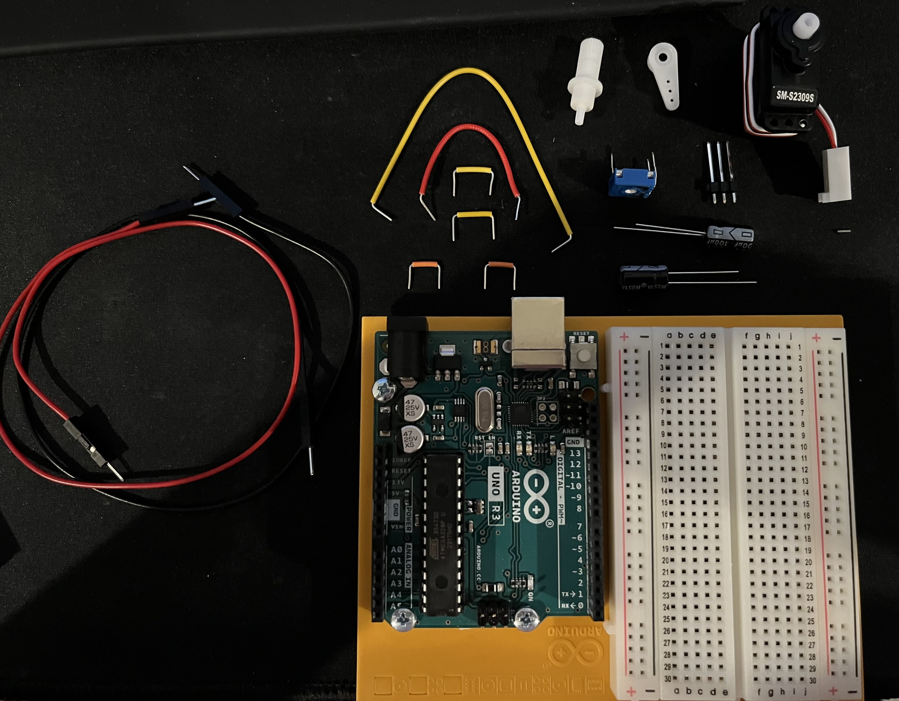
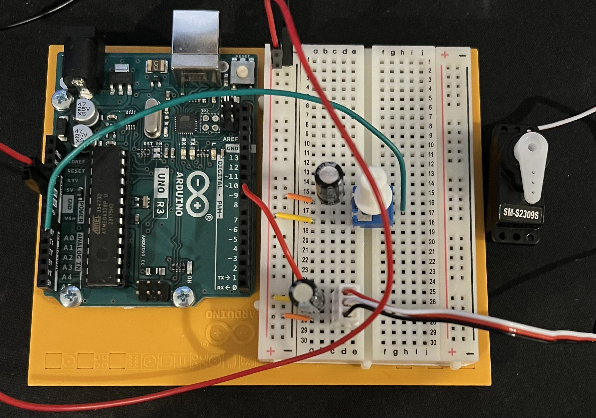
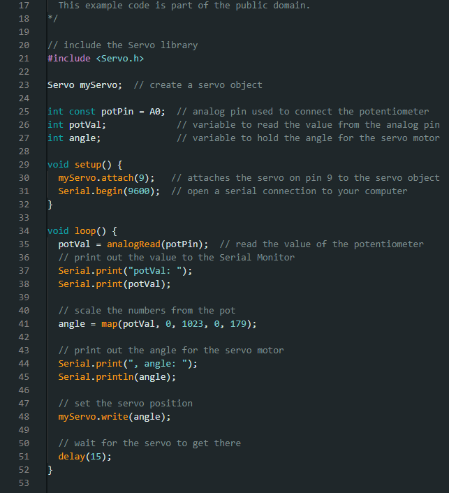

# HW 5: Mood Cue
Hello there, come with me as I make a Mood Cue.

## Materials

The materials needed for this project were the Arduino Uno, breadboard, a potentiometer, servo motor, 3 male headers, 2 100 uf capacitors, and jumper wires.

## Creating the Circuit

Before building the circuit I had to make sure any battery or USB was disconnected.

Step 1: I connected power and ground to the breadboard from the 5V and GND pin.

Step 2: I placed the potentiometer on the breadboard and connected the side with one leg to analog pin 0.
The other side I connected one leg to ground and the other leg to power.
I used a jumper wire and made sure there was room in between the two legs and wires for a capacitor we're adding later.

Step 3: I took 3 male headers and attached them into the female ends of the servo wire. 
A tricky part about this was to move the black piece holding them together down so it could stay in place. 
After I did that, I attached the other end into the breadboard. 
Then, I connected the red wire to power, the black wire to ground, and the white wire to pin 9. 
I did all of that by using jumper wires.
For this step I also made sure there was room for a capacitor in between the jumper wires and servo motor.

Step 4: I added two capacitors to smooth the voltage drop from the servo motor starting to move. 
One in between the potentiometer and jumper wires, and the other in between the servo motor and jumper wires. 
When connecting a capacitor it is important you put them in the correct way otherwise they might explode, and that's no fun. So, to make sure they are put in properly you connect the capacitor's cathode and connect it to ground. 
You also want the capacitor's anode to go to power.

Step 5: I uploaded the code provided for this exercise to the Arduino.

Now I have completed the Mood Cue. 
As you can see the servo motor moves while I turn the potentiometer.

The video below demonstrates this.

## Summary

Overall, in this chapter I learned how to make a Mood Cue that moves a servo motor when I turn the potentiometer.
I also was introduced to capacitors, servo motors, and potentiometers.
