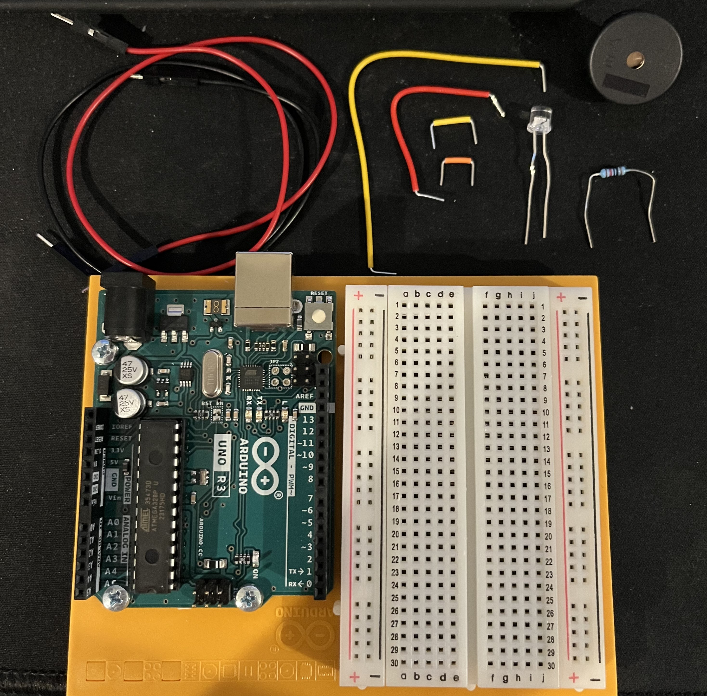
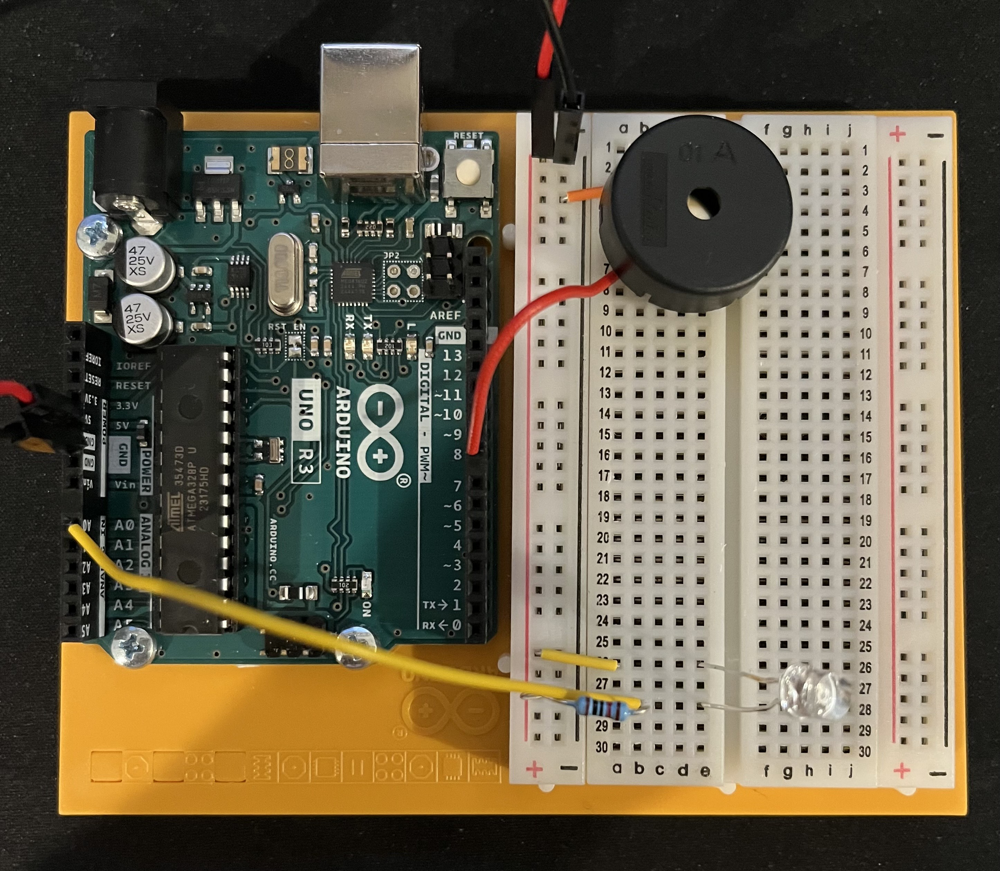
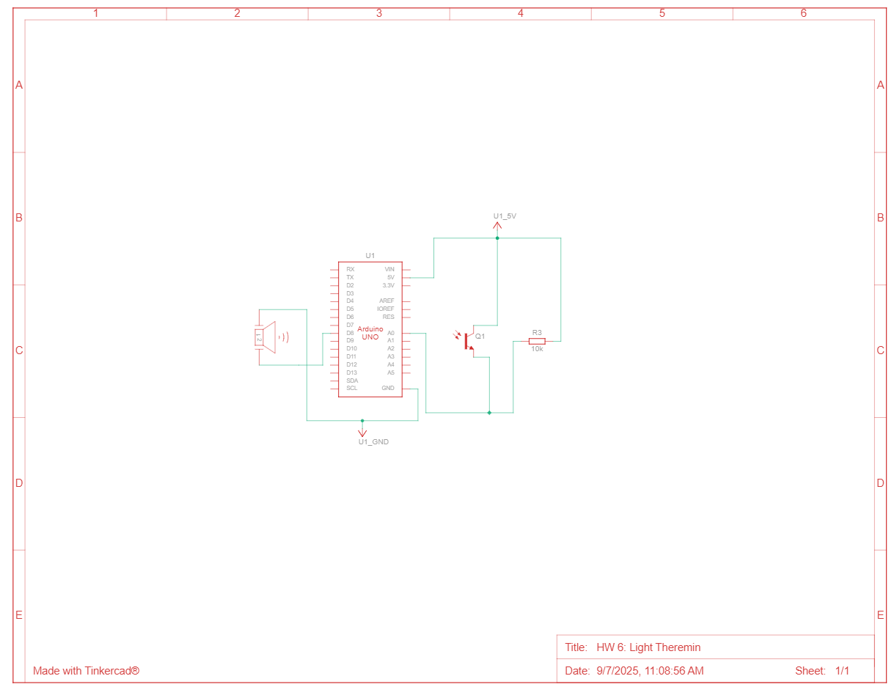

# HW 6: Light Theremin
Hello there, come with me as I make a Light Theremin.

## Materials

The materials needed for this project were the Arduino Uno, breadboard, a piezo, a phototransistor, 10 Kohm resistor, and jumper wires.

If you want to create it in TinkerCad the materials are listed below.

## Creating the Circuit

Before building the circuit, I had to make sure any battery or USB was disconnected.

Step 1: I connected power and ground to the breadboard from the 5V and GND pin.

Step 2: I connected my piezo to the breadboard and connected one end to ground and the other end to digital pin 8.
Piezo's are not polarized so it doesn't matter what side is connected to what.

Step 3: I connected my phototransistor onto the breadboard.
I took a jumper wire and connected the anode to power.
Then, I took another jumper wire and connected the cathode to pin A0 and to ground through a 10 Kohm resistor.

Step 4: I uploaded the code provided for this exercise to the Arduino.

Now I have completed the Light Theremin. 
As you can see the piezo plays a certain sound when the amount of light that hits the phototransistor changes.

The video below demonstrates this.

Below is also a schematic view of the project as well.

## Summary

Overall, in this chapter I learned how to make a Light Theremin that produces a sound from the piezo in response to the amount of light the phototransistor receives.
Also, the real life circuit sounds a lot better than the TinkerCad circuit.
