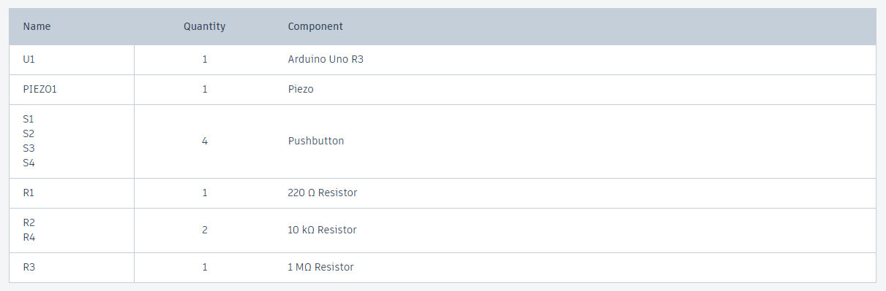
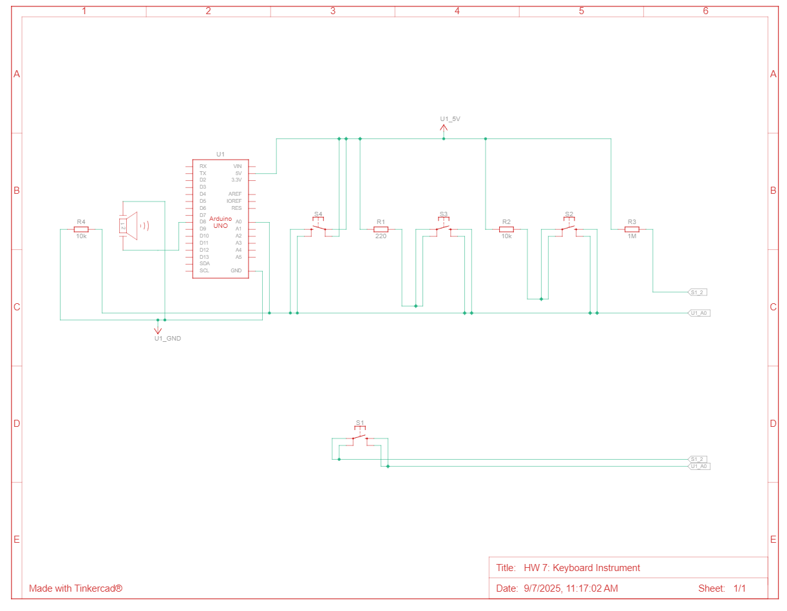

# HW 7: Keyboard Instrument
Hello there, come with me as I make a Keyboard Instrument.

## Materials

The materials needed for this project were the Arduino Uno, breadboard, a piezo, 4 buttons, 1 220 ohm resistor, 2 10 Kohm resistors, 1 1 Mohm resistor, and jumper wires.

If you want to create it in TinkerCad the materials are listed below.

## Creating the Circuit

Before building the circuit, I had to make sure any battery or USB was disconnected.

Step 1: I connected power and ground to the breadboard from the 5V and GND pin.

Step 2: I connected my piezo to the breadboard and connected one end to ground and the other end to digital pin 8.
Piezos are not polarized so it doesn't matter what side is connected to what.

Step 3: I attached 4 buttons to the breadboard with their legs facing away from the center.
Then I connected the back left legs of the buttons to the top left legs of the button above it.
I attached a 220 ohm resistor to the top leg of the second button to power.
I did the same thing but with a 10 Kohm resistor connecting to the third button and the fourth button with a 1 Mohm resistor.
Afterward, I took the very top leg and connected it to power and the very bottom leg to pin A0 and through ground using a 10 Kohm resistor.
This setup here is called a resistor ladder, it acts as a voltage divider.

Step 4: I uploaded the code provided for this exercise to the Arduino.

Now I have completed the Keyboard Instrument. 
As you can see the piezo plays a certain sound when a certain button is pressed.

The video below demonstrates this.

Below is also a schematic view of the project as well.

## Summary

Overall, in this chapter I learned how to make a Keyboard Instrument that produces a certain sound from the piezo in response to the specific button being clicked.
Also, in the video you can hear me play Mary had a Little Lamb.
So far this has been my favorite project. 
