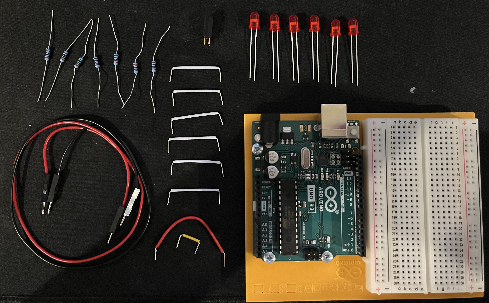
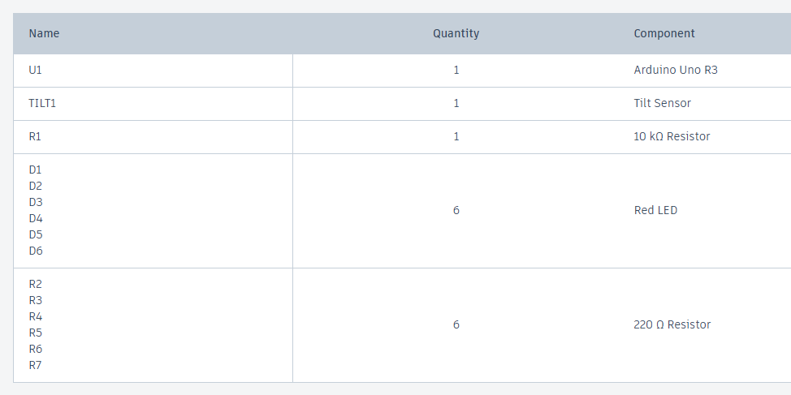
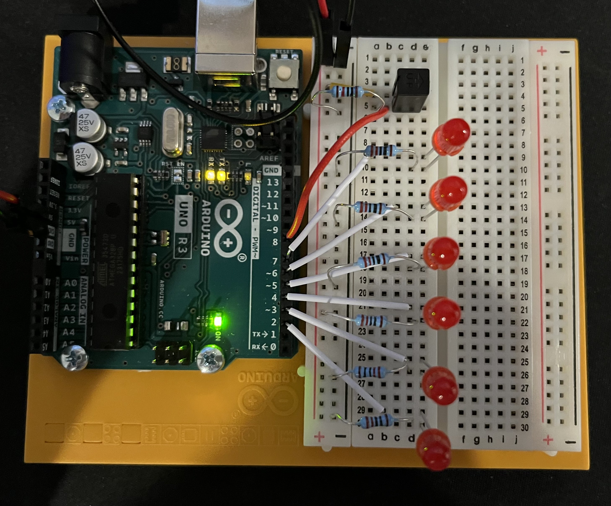
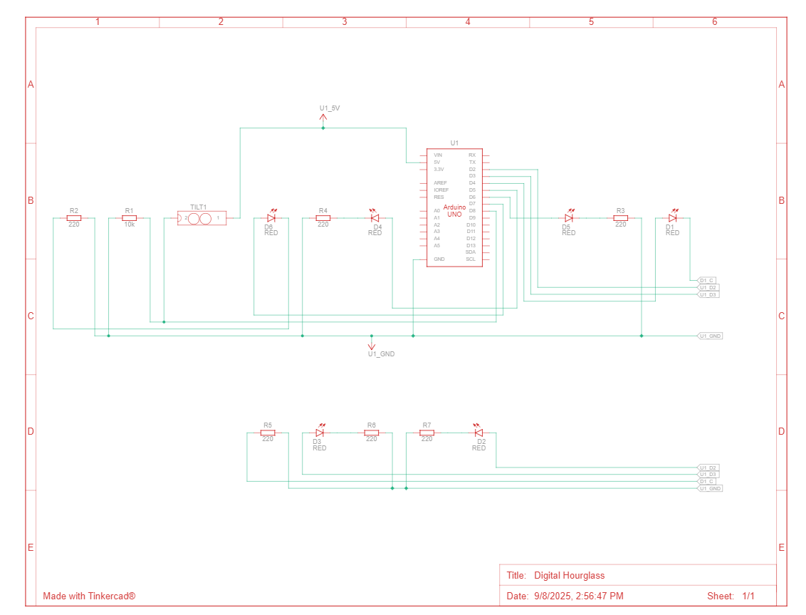

# HW 7: Digital Hourglass
Hello there, come with me as I make a Digital Hourglass.

## Materials

The materials needed for this project were the Arduino Uno, breadboard, 6 red LEDs, 1 10 Kohm resistor, 6 220 ohm resistors, a tilt switch, and jumper wires.

If you want to create it in TinkerCad the materials are listed below.

## Creating the Circuit

Before building the circuit, I had to make sure any battery or USB was disconnected.

Step 1: I connected power and ground to the breadboard from the 5V and GND pin.

Step 2: I connected each LED into the breadboard by connecting the anode to digital pins 2-7 and the cathode to ground using a 220 ohm resistor.

Step 3: I connected the tilt switch into the breadboard.
I connected one leg to power and the other leg to digital pin 8 and ground through a 10 Kohm resistor.
The wire to digital pin 8 is inbetween the resistor and leg.

Step 4: I uploaded the code provided for this exercise to the Arduino.

Now I have completed the Digital Hourglass. 
As you can see the LEDs light up once the time ends.

The video below demonstrates this.

Below is also a schematic view of the project as well.

## Summary

Overall, in this chapter I learned how to make a Digital Hourglass that lights up once the time runs out.
Originally the time was set to 10 mins but I didn't want to wait that long so I set it to one second instead.
