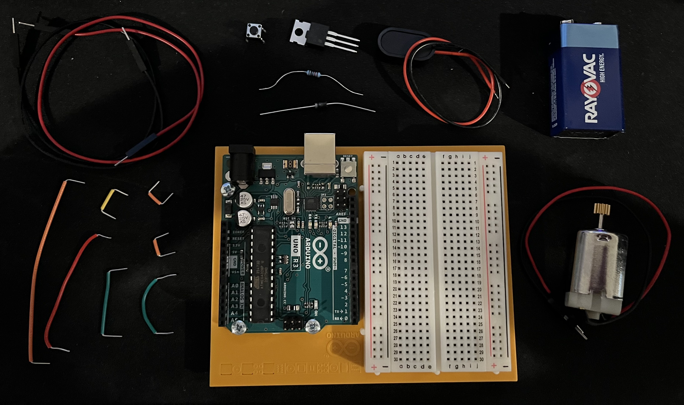
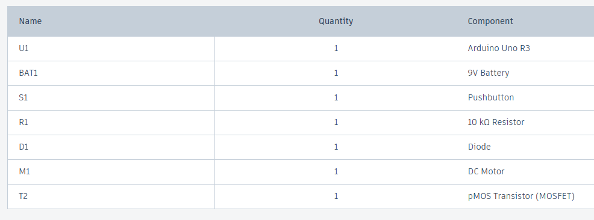
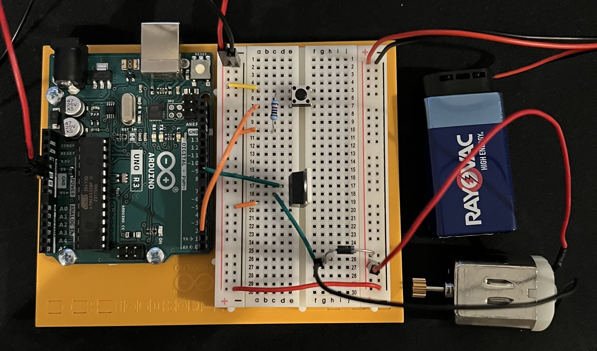
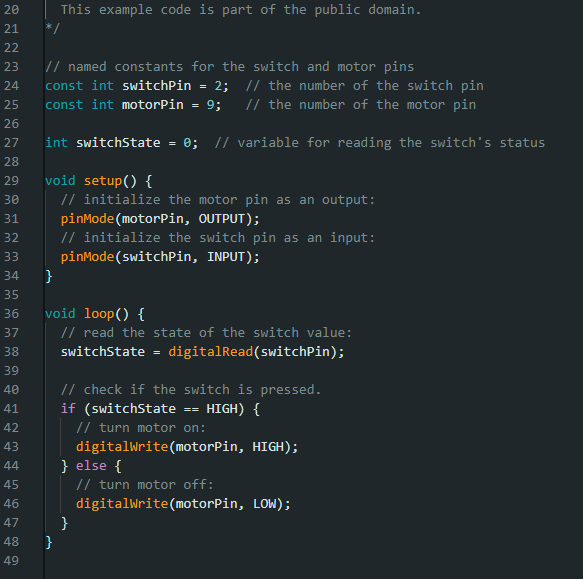
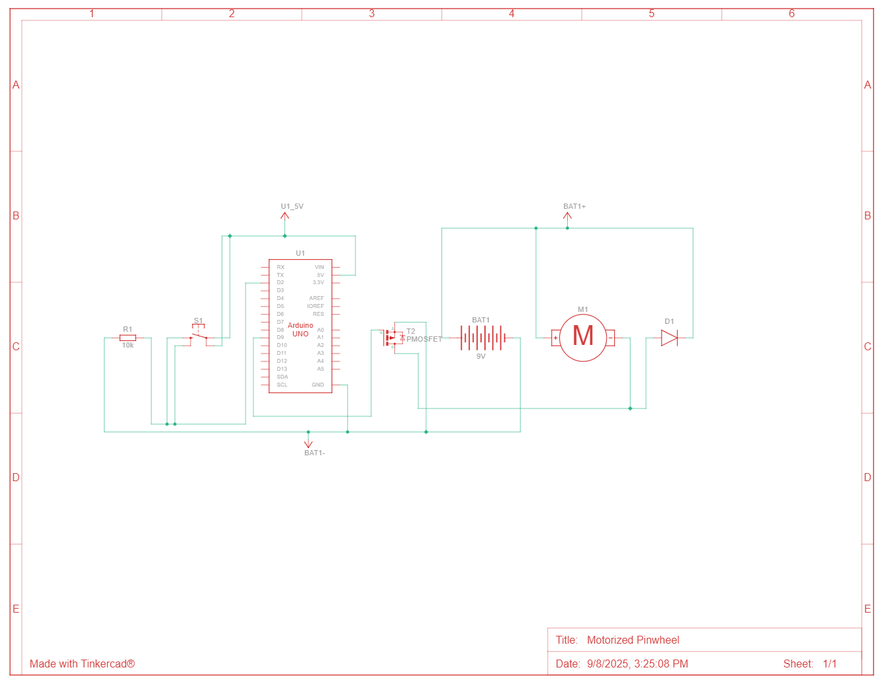

# HW 9: Motorized Pinwheel
Hello there, come with me as I make a Motorized Pinwheel.

## Materials

The materials needed for this project were the Arduino Uno, breadboard, 9V battery, a battery snap, DC motor, a diode, 1 10 Kohm resistor, a transistor, a button, and jumper wires.

If you want to create it in TinkerCad the materials are listed below.

## Creating the Circuit

Before building the circuit, I had to make sure any battery or USB was disconnected.

Step 1: I connected power and ground to the breadboard from the 5V and GND pin.

Step 2: I added a button to the board by connecting one leg to power and the other to digital pin 2 and ground using a 10 Kohm resistor.

Step 3: I connected ground from the left side of the breadboard to the right. 
I then attached the battery and battery snap together. 
I connected the red wire to power and the black wire to ground.
I then attached the motor's red wire to power on the right side.

Step 4: I placed the transistor onto the board and had the metal tab facing away from the Arduino.
I connected digital pin 9 to the left leg of the transistor, this is called the gate.
A change in voltage on the gate makes a connection between the other two pins.
I connected the right leg of the transistor to ground, this is called the source.

Step 5: I connected the middle leg of the transistor to the motor's black wire.
I then connected the motor to ground using the diode.
The diode is polarized so it is important the way you put it in.
As you can see the diode has a side with a stripe, that stripe shows which side is negative.
You want the negative side to be facing ground while the positive side is connected to the motor's black wire.

Step 6: I uploaded the code provided for this exercise to the Arduino.

Now I have completed the Motorized Pinwheel.
As you can see the motor spins when I press the button.

The video below demonstrates this.

Below is also a schematic view of the project as well.

## Summary

Overall, in this chapter I learned how to make a Motorized Pinwheel that spins a motor when a button is pressed.

