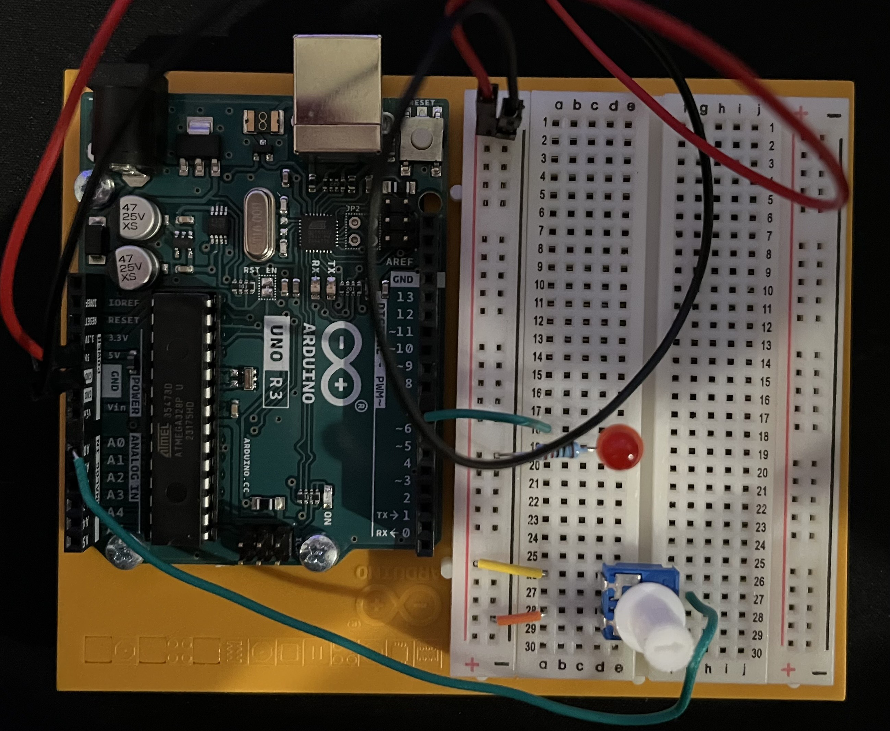

# Participation: Fun With Unity
Hello there, come with me as I connect the Arduino to Unity.

## Materials

The materials needed for this project were the Arduino Uno, breadboard, a potentiometer, a 220 ohm resistor, a LED, and jumper wires.

If you want to create it in TinkerCad the materials are listed below.

## Creating the Circuit

Before building the circuit, I had to make sure any battery or USB was disconnected.

Step 1: I connected power and ground to the breadboard from 5V and GND pin.

Step 2: I connected the LED to the breadboard. The anode went to digital pin 7 and the cathode went to ground through a 220 ohm resistor.

Step 3: Then I connected the potentiometer. The left pin went to power, the right pin went to ground, and the middle pin went to pin A0.

Step 4: I uploaded the code to the Arduino and created code for Unity.
In the Arduino IDE it gets the value of the potentiometer and maps it. 
It then send that data as a string to Unity. 
Unity then reads the line and splits it up into an array.
It checks if the data is valid and if so it moves the cube based on the map data that was sent in.
Then Unity checks if the position is less than 0 and if so it sends a string to the Arduino IDE.
The Arduino IDE checks if it's a 1 or 0 and then turns on or off the LED.

Now I have connected the Arduino to Unity.
As you can see when I turn the potentiometer the cube in Unity moves.

The video below demonstrates this.

Below is also a schematic view of the project as well.

## Summary

Overall, I learned how to connect the Arduino to Unity which will be helpful for Project 2. 
