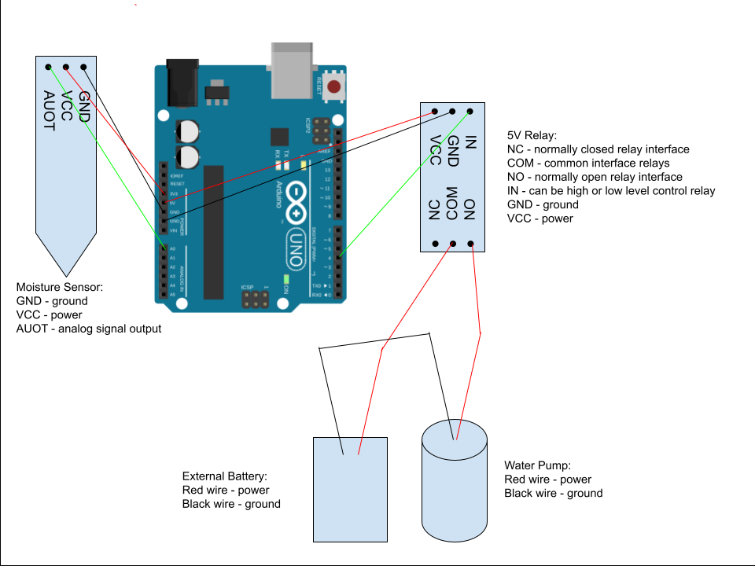

# Project 1: Plant Problem
Hello there, I have a problem. My problem is that I’m going to be leaving my house for a couple of days and won’t be able to water my plants.
So I came up with the Automatic Watering System, where you can stay gone while your plants carry on.
This solution works because the Arduino will read the values off the moisture sensor.
If that value drops below a certain level, it will then activate the pump and water the plant.
Once it goes above the level, the pump will turn off.

## Materials

Initially, I thought the only materials I needed were the Arduino Uno, a moisture sensor, an external battery (I used a 6V battery holder so I also needed 4 AA batteries), a 5V relay, a water pump, tubing, jumper wires, a plant, and a bowl with water.

As I was making this, I realized I was wrong.
The final parts list included: 
- Arduino Uno
- Moisture sensor
- An external battery (I used a 6V battery holder so I also needed 4 AA batteries)
- 5V relay
- Water pump
- Tubing
- Jumper wires
- A plant
- A bowl with water
- Tape
- The black piece on the male headers
- Screwdriver
- Scissors
- Pan

I realized during the process I should’ve gotten female jumper wires. Then I wouldn’t have needed as much tape. It also would’ve made connecting everything easier.

## Creating the Circuit

Before building the circuit, I had to make sure any battery or USB was disconnected.

Step 1: I connected the moisture sensor to the Arduino.
The VCC pin on the sensor went to 3.3V.
The GND pin on the sensor went to GND.
The AOUT pin on the sensor went to A0.
The kit gave me a female jumper wire, but I realized it wouldn’t reach my plant.
So, I stuck jumper wires into one end and attached them to the Arduino in the corresponding pins.

Step 2: I connected the 5V relay to the Arduino, water pump, and power.
The problem with this was that the IN, GND, and VCC were male pins.
Hence why getting female jumper wires would’ve been helpful.
At first, I thought I should tape them, but it didn’t stick that well.
So instead, I made a loop on one end of the jumper wire and put it around the pins.
Though with this method, the wires would slide off.
So, I took the black part from the male headers that came in the Arduino kit and put it on top so they wouldn’t come off.
Then I connected the wires accordingly.
The IN pin went to digital pin 4.
The GND pin went to the GND pin.
The VCC pin went to 5V.
I also had to add another jumper wire to each one because it wasn’t long enough.
I just used tape to hold them together.
That was only the first side.
The next side was attaching the relay to the pump and external power source, which in my case was a 6V battery holder.
Based on prior research, you could use any voltage close to 5V.
You can’t share the 5V pin on the Arduino, though, because it wouldn’t get enough power.
So at first, I connected the pump’s power to COM, the battery’s power to NO, and the pump’s ground to the battery’s ground.
The problem was that the relay was in Chinese, so I had to look up what the symbols meant before I connected everything.
But I was able to figure it out.

Step 3: Once everything was connected, I taped the water pump into the bowl and put the moisture sensor in the pot.

Step 4: I then uploaded the code to the Arduino.
The code reads in a value from the moisture sensor and assigns it to the int moisture.
Then it checks if that value is higher than the threshold.
If it is, it turns the pump on.
Otherwise, it turns it off.
While coding this, I thought it was weird that the higher the number, the drier it is.
I thought the higher number would mean more moisture.
Sadly, it did not work the first time.
The relay detected that the pump was supposed to be on, but the pump didn’t turn on.
I figured I messed something up with the relay connection.
As I took a look, the pump and battery had little wire sticking out.
So I thought maybe that’s why it wasn’t turning on.
I decided to strip the wires, though I didn’t have wire cutters, so I used scissors.
I lost some wire in the process, but I was able to get it eventually.
Once I reconnected it, I tried again, and it still didn’t work.
Well, it did, but in the opposite way.
Apparently, some relays turn on when you send them a LOW input instead of a HIGH input.
Initially, I had it turn on using HIGH.
So once I switched those two lines, it ended up working.
It was a bit finicky, though.
Most of the time it worked, but other times the relay wouldn’t activate.
If it didn’t activate, you just had to shake it a little bit, and then it would work for some reason.

The video below demonstrates the Automatic Watering System.

Below is also a schematic view of the project as well.

## Summary

Overall, this was a very fun project and I'm proud of what I made.
Though I do think I’ve now overwatered my plant from all the testing.
That was another challenging bit.
My plant would keep getting watered, so every time I had to change the threshold value.
Also, in the parts list, I mentioned a pan.
As you can see in the images and videos, I put the water and plant in a pan so if it didn’t turn off, my desk and electronics wouldn’t get wet.
If I were to make this again I'd definetly get female jumper wires.

To learn more about the process check out the Post Mortem video down below.

## Resources

Automatic Irrigation DIY Kit Self Watering System Capacitive Soil Moisture Sensor 1 Channel 5V Relay Module and Water Pump with 2pcs 1M Vinyl Tubing for Arduino Moisture Detection Garden Watering DIY: 
https://www.amazon.com/gp/product/B097BGSG6T?smid=A39S0U3UP1U7UG&psc=1

(Pack of 2 4 AA Battery Holder, 4 AA Battery Holder with Leads, 4 AA Battery Holder with Wires: 
https://www.amazon.com/LAMPVPATH-Battery-Holder-Leads-Wires/dp/B07T7MTRZX?crid=OABA1H89856B&dib=eyJ2IjoiMSJ9.85zkZZN8CrCVX_AFD_IScpKiUH8sNur0YUMRpciulryIXwnWxDED3Xq_epetLJUvPy7ILKosL4jtmiM_hUAwRqx0fSoKOxAIg2iGoIJerV0nIqBk0Hj0HJrD1C5UzPumf6Kt5uSXAnMaP4XXc1smjCX7iOvRrRP9JRTDLo8LXmKl46fDcjAapGPWiHBi_obmmzTolggXKw6V-DZByJwyKoolP3VsWhf3lqAaCP0sQ4U.xTtk1EoxsdHNLDzLQ9t0kaLnFZofXFOY7QZHEqJwobY&dib_tag=se&keywords=5v+aa+battery+pack+with+leads&qid=1760729248&sprefix=5v+aa+battery+pack+with+leads%2Caps%2C67&sr=8-14

How to make Automatic Plant Watering System using Arduino UNO and Soil Sensor || Techie Lagan: https://www.youtube.com/watch?v=iwkE_HWU-6M&t=2s

Automated Watering System for Plants | Arduino DIY Projects | Step by Step Guide: https://www.youtube.com/watch?v=wFPEO_c_hTg
