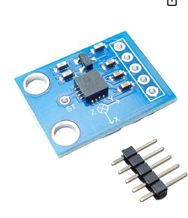
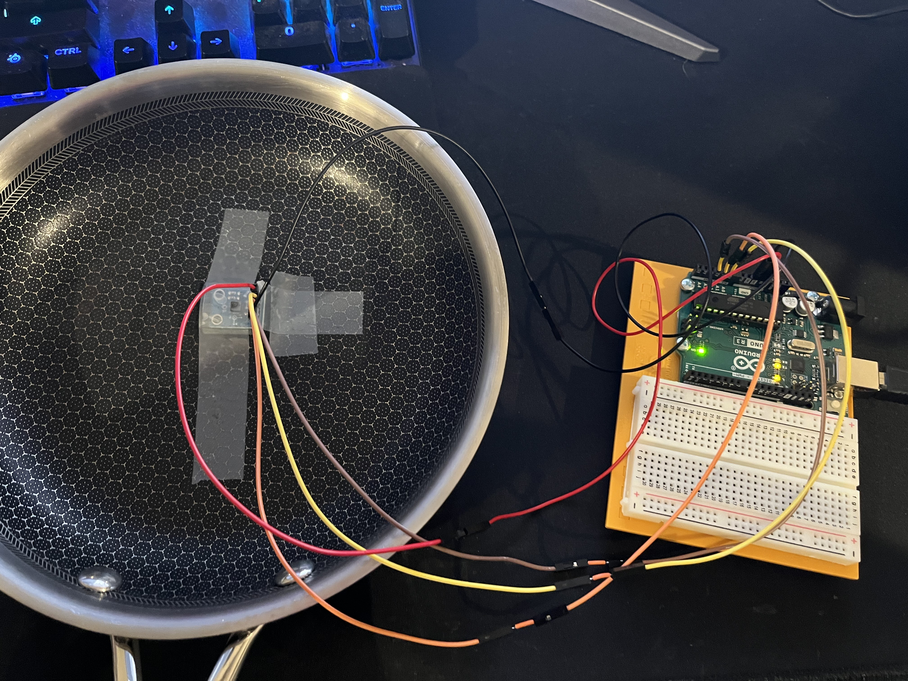
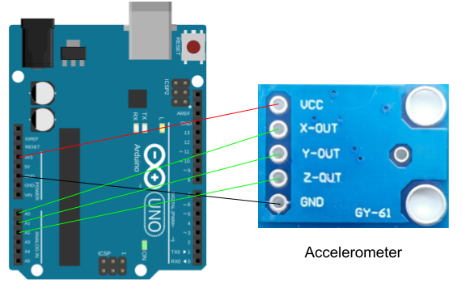

# Project 2: Alternative Controller
Hello there, come with me as I use the Arduino to control a game in Unity.
The game I'll be playing is called Pancake Panic.
In this game you are a chef in a diner, you are assigned to flip pancakes.
Your goal is to help the diner get good reviews, too many bad reviews and you're fired.
How the game works is that you will use a frying pan with an accelerometer attached to control when to flip.
Make sure to time the flip right otherwise you may get an under or over cooked pancake. 

## Materials

While buying/collecting materials I learned my lesson from Project 1 and I decided to buy female to female jumper wires.

The final parts list included: 
- Arduino Uno
- Accelerometer
- Jumper wires
- Male headers
- Frying pan
- Tape
- Small piece of foam

During the process I had all the materials needed to complete this project with ease.

## Creating the Circuit

Before building the circuit, I had to make sure any battery or USB was disconnected.

Step 1: I connected the acclerometer to the Arduino.
The VCC pin on the sensor went to 5V.
The GND pin on the sensor went to GND.
The X-OUT pin on the sensor went to A0.
The Y-OUT pin on the sensor went to A1.
The Z-OUT pin on the sensor went to A2.
Using the male headers the accelerometer gave me I was able to connect the female wires to the sensor.
I also combined 2 female wires to a male to male jumper wire to increase the movement I can do with the pan. 
Then using another male to male jumper wire I attached the female wires to the pins in the Arduino.
Afterwards I took a small piece of foam and put it under the accelerometer so it can be flat on the frying pan.
Then I taped it down aligning the x-axis with the handle.

Step 2: I then uploaded the code to the Arduino and Unity.
How it works is in the Arduino IDE the acclerometer checks the voltage from the X-OUT pin and checks if it crosses the threshold and it's previous state was not flipped. 
If it wasn't flipped it now tells Unity that it was flipped along with the voltage.
Once the voltage passes the reset threshold it allows a flip to be registered again.
This is to prevent the sensor detecting flips back to back.

The video below demonstrates the Alternative Controller.

Below is also a schematic view of the project as well.

## Summary

Overall, this was a very fun project and I'm proud of what I made.

To learn more about the process check out the Post Mortem video down below.

## Resources

ADXL335 3-Axis Accelerometer Module, Analog Output, GY-61: https://www.amazon.com/ADXL335-3-Axis-Accelerometer-Module-Analog/dp/B0DGLP66VQ?crid=27O9UHYPWBP7W&dib=eyJ2IjoiMSJ9.p5vFIKDJH4S9BCuWxR4R6CZ0nkv5yHodMPRiEoHbDCgbM4Z4tpQt7ixRyqKhd6MfWVf3LdohV3nfs3DUshCdQ86py1tiaSHxl16exulY-HqCQ_nHmLLCdcInvq6iy5-74j2toOL0fGPA1r-rf02HZB0vRTh_XwLSN8BF2yU13Or0PdjXrrVuyFCWQIM_j2ayiTNjWTHbkylS1MKquLNoBvf9jXIUf7dpEDLnJZiTwOc.gk4n-_7v6He_Rs7E-Cxx07Kcl4McttqBB4dgamnVh0w&dib_tag=se&keywords=3-axis+ADXL335&qid=1761591698&sprefix=3-axis+adxl335%2Caps%2C118&sr=8-11

How to Use an Accelerometer with Arduino (Lesson #41): https://www.youtube.com/watch?v=zpV7ac3ecl4

Super Mario Party Jamboree: https://www.nintendo.com/us/store/products/super-mario-party-jamboree-switch/
