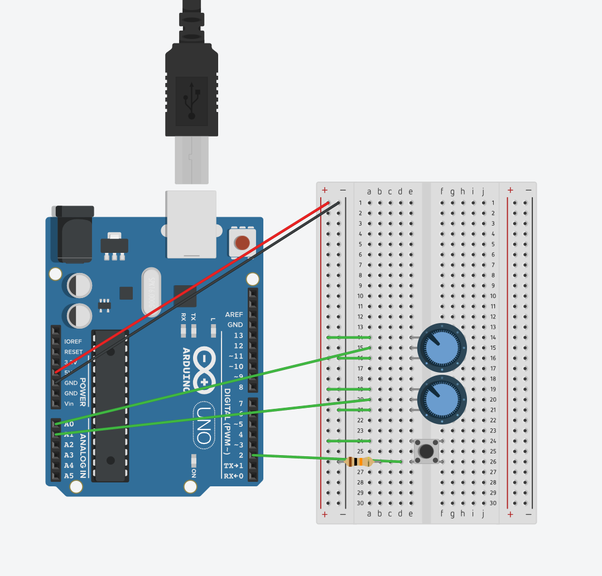
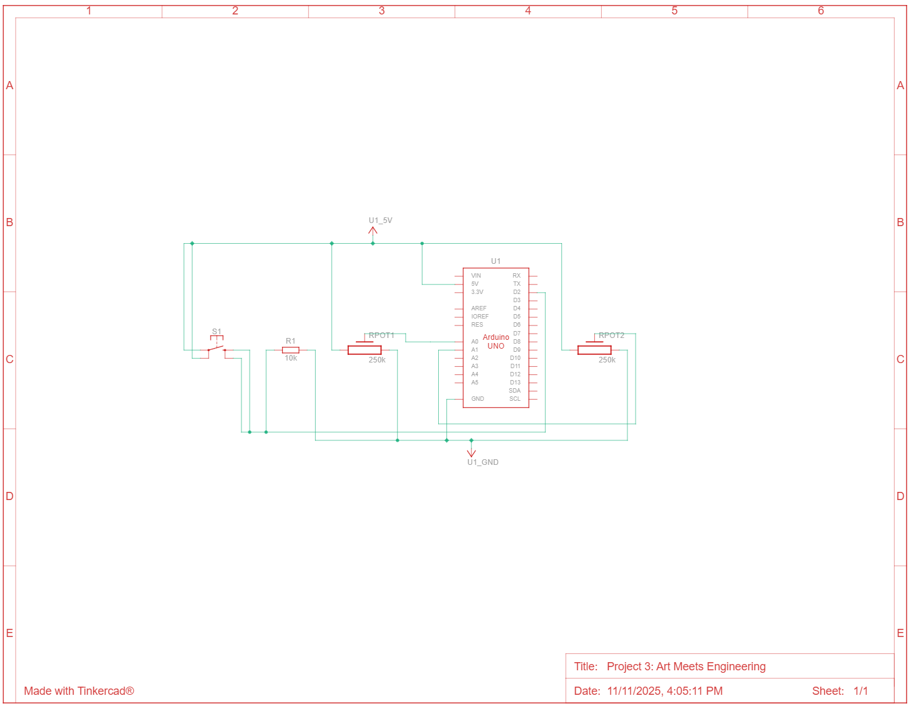

# Project 3: Art Meets Engineering
Hello there, come with me as I use the Arduino to make art.
Using potientiometers the Arduino will be made into an EtchASketch.

## Materials

The materials needed were all included in the Arduino Starter Kit, so I didn't need to buy anything which is nice.

The final parts list included: 
- Arduino Uno
- 2 Potientiometers
- 1 Button
- 1 10 kohm resistor
- Jumper wires
- Processing IDE

During the process I had all the materials needed to complete this project with ease.

## Creating the Circuit

Before building the circuit, I had to make sure any battery or USB was disconnected.

Step 1: I connected the 5V and GND pin to the breadboard.

Step 2: I connected the button to the Arduino by connecting one leg to power and the other through digital pin 2 and ground through a 10 kohm resistor.

Step 3: I connected the potientiometers to the Arduino. The left leg went to power, the right went to ground, and the middle went to pins A0 and A1.

If you wanted to make the circuit in TinkerCad this is how you'd set it up.

Step 4: I then uploaded the code to the Arduino and the Processing IDE.
How it works is the Arduino reads the two potientiometer values.
The left one is for horizontal movement and the right one is for vertical movement.
Once it reads the values it then maps it to the canvas width and height.
So a main difference from your typical EtchASketch is that this version the position of the potientiometers correlate to the canvas position.
Then the Arduino checks if a button was pressed to clear the screen.
It then send the x value, y value, and button state to the Processing IDE.
In the Processing IDE it creates the canvas and connects to the Arduino.
Then in the draw method it reads in the data. 
If it's null it exits the function.
Otherwise it splits the string into an array.
If the data is incorrectly formatted it also exits the function.
Otherwise it sets the values from the Arduino.
Afterwards it checks if the button is hit and if so it clears the canvas.
If the button isn't hit it draws a line from the previous position to the current position.
Then it saves the state.
Now you have an EtchASketch.
At first I originally drew pixels but then there were gaps inbetween the lines. 
I also had to increase the frame rate because it would be too slow the line would jump drastically.

The video below demonstrates the Arduino EtchASketch.

Below is also a schematic view of the project as well.

## Summary

Overall, this was a very fun project and I'm proud of what I made.
The main challenge was the processing code because I was unfamilar with that the most.
But luckly the documentation helped me out a lot.

To learn more about the process check out the Post Mortem video down below.

## Resources

TFTEtchASketch: https://docs.arduino.cc/retired/library-examples/tft-library/TFTEtchASketch/#hardware-required

Processing Documentation: https://processing.org/reference

