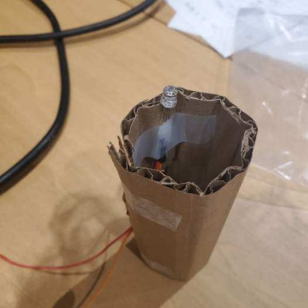

# Project 4: You or a Friend's Problem
Creators: Shaelin Brown & Will Imburgia

Hello there, come with use as we make a game.
Using photoresistors and an ultrasonic sensor we are making a heist simulator game where you have the sensor act as a camera and you have to avoid it while stealing all the treasure.

## Materials

Luckily all the materials needed we had so we didn't need to buy anything which is nice.

The final parts list included:

- Arduino Uno
- 2 Photoresistors
- 2 10 kohm resistors
- Jumper wires
- 1 9V battery
- 1 DC motor
- 1 H-bridge
- Ultrasonic sensor

During the process we had all the materials needed to complete this project with ease.

## Creating the Circuit

Before building the circuit, we had to make sure any battery or USB was disconnected.

Step 1: We connected the 5V and GND pin to the breadboard.

Step 2: We connected the photoresistors to the breadboard.
The anode went to power while the cathode went to analog pins 0 and 1.
It also went to ground through a 10 kohm resistor.

Step 3: We connected the dc motor to the breadboard. 
We first attached the battery's power and ground to the opposite side of the breadboard.
We then connected both grounds together.
Afterwards we took the dc motor and connected it to the H-Bridge and connected that to the breadboard.
The motors power went to H-bridge pin 6.
The motors ground went to H-bridge pin 3.
Then for the H-bridge pin 1 went to digital pin 6.
Pin 2 went to digital pin 3.
Pin 7 went to digital pin 2.
Pin 8 went to power.

Step 4: We connected the ultrasonic sensor to the breadboard.
The VCC pin went to power.
The GND pin went to ground.
The TRIG pin went to digital pin 10.
The ECHO pin went to digital pin 9

If you wanted to make the circuit in Tinkercad this is how you'd set it up.

Step 4: I then uploaded the code to the Arduino.
How it works is it checks if the game is over. 
If it's over you either win or lose which will stop the sensor and tell you if you won or lost. 
Otherwise it the checks it the sensor has rotated for a certain amount of time.
If it has it then switches the rotation.
Afterwards it reads the distance from the sensor and the photoresistor values. 
If the values passes a certain threshold you win because that means you stole all the treasure.
If the sensor passes a certain threshold you lose because that means the sensor caught you trying to steal the treasure.

The video below demonstrates the game.

Below is also a schematic view of the project as well.

## Summary

Overall, this was a very fun project and we're proud of what we made.
One challenge we had was the photoresistors weren't dectecting anything and that's because we were using a 220 ohm resistor rather than a 10 kohm. 
Another challege was that we initially didn't use an H-bridge so when the motor rotated the wire from the sensor would wrap around it. 

To learn more about the process check out the Post Mortem video down below.

