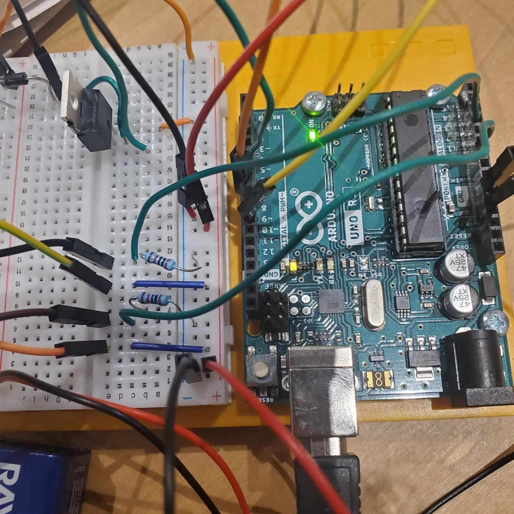
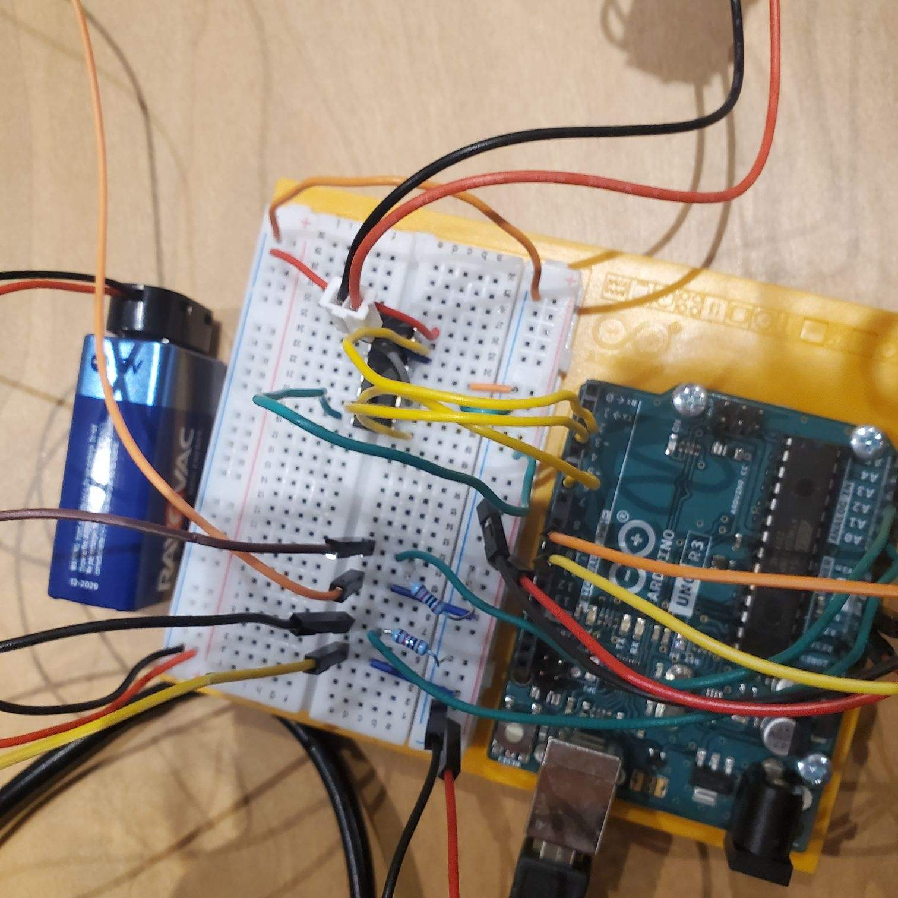
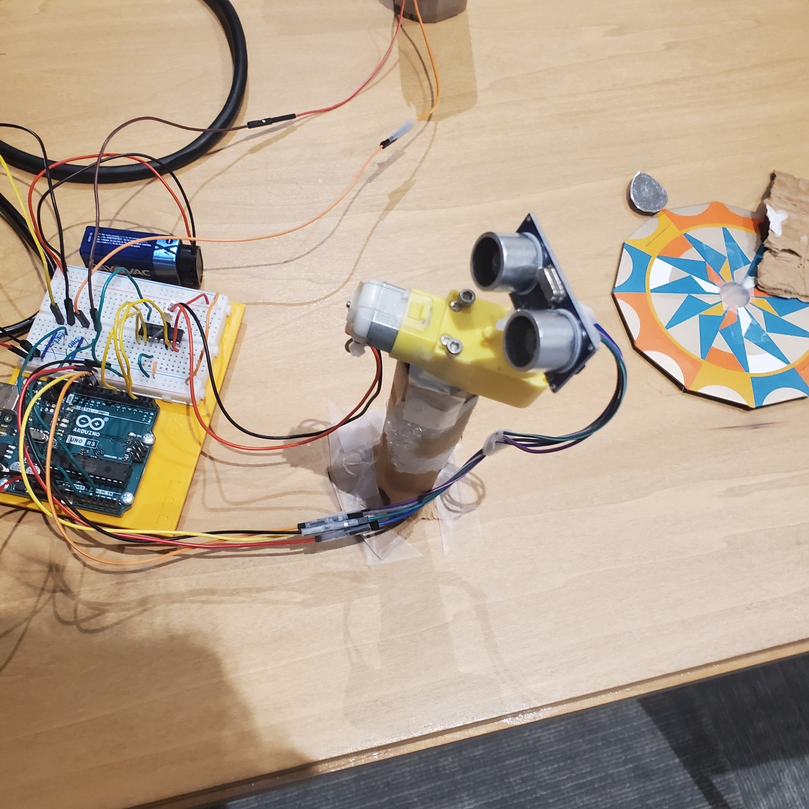
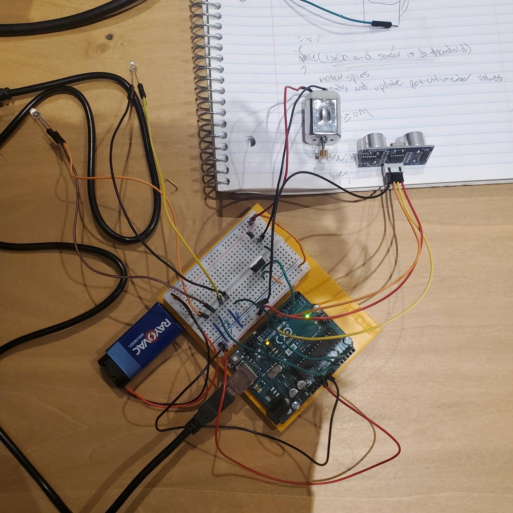
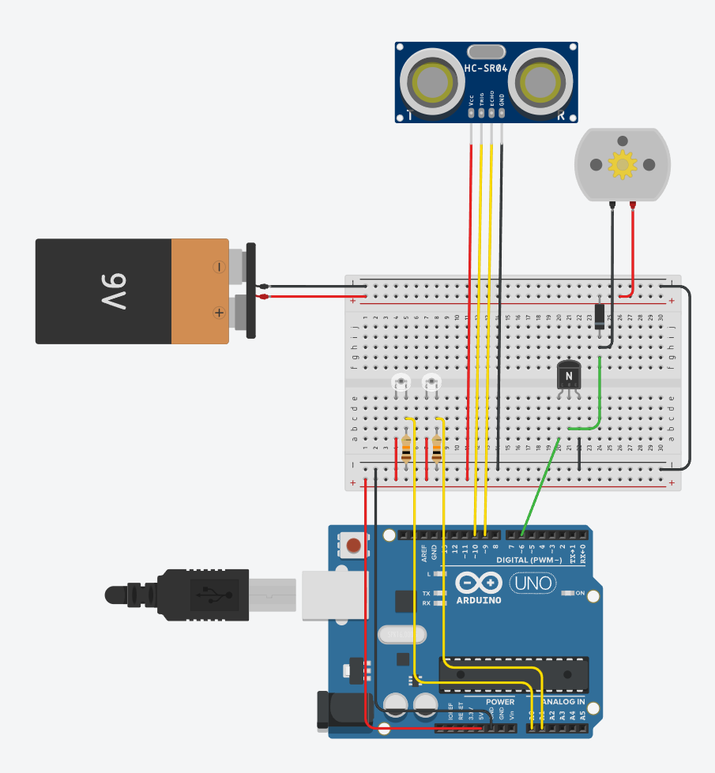
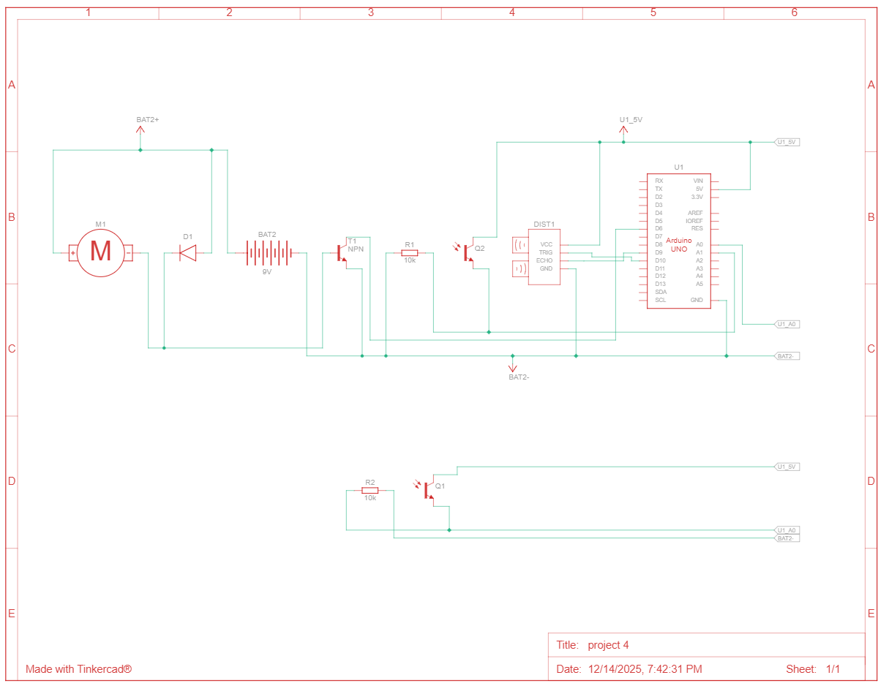

# Project 4: You or a Friend's Problem
Creators: Shaelin Brown & Will Imburgia

Hello there, come with use as we make a game.
Using photoresistors and an ultrasonic sensor we are making a heist simulator game where you have the sensor act as a camera and you have to avoid it while stealing all the treasure.

## Materials

Luckily all the materials needed we had so we didn't need to buy anything which is nice.

The final parts list included:

- Arduino Uno
- 2 Photoresistors
- 2 10 kohm resistors
- Jumper wires
- 1 9V battery
- 1 DC motor
- 1 diode
- 1 transistor
- Ultrasonic sensor

During the process we had all the materials needed to complete this project with ease.

## Creating the Circuit

Before building the circuit, we had to make sure any battery or USB was disconnected.

Step 1: We connected the 5V and GND pin to the breadboard.

Step 2: We connected the photoresistors to the breadboard.
The anode went to power while the cathode went to analog pins 0 and 1.
It also went to ground through a 10 kohm resistor.

Step 3: We connected the dc motor to the breadboard. 
We first attached the battery's power and ground to the opposite side of the breadboard.
We then connected both grounds together.
Afterwards we took the dc motor and plugged its power to power.
We also connected ground to ground through a diode.
It also went to the middle pin of the transistor.
The left transistor pin went to digital pin 6.
The right transistor pin went to ground.

Step 4: We connected the ultrasonic sensor to the breadboard.
The VCC pin went to power.
The GND pin went to ground.
The TRIG pin went to digital pin 10.
The ECHO pin went to digital pin 9

If you wanted to make the circuit in Tinkercad this is how you'd set it up.

Step 4: I then uploaded the code to the Arduino.

The video below demonstrates the game.

Below is also a schematic view of the project as well.

## Summary

Overall, this was a very fun project and we're proud of what we made.
One challenge we had was the photoresistors weren't dectecting anything and that's because we were using a 220 ohm resistor rather than a 10 kohm. 

To learn more about the process check out the Post Mortem video down below.

## Resources

